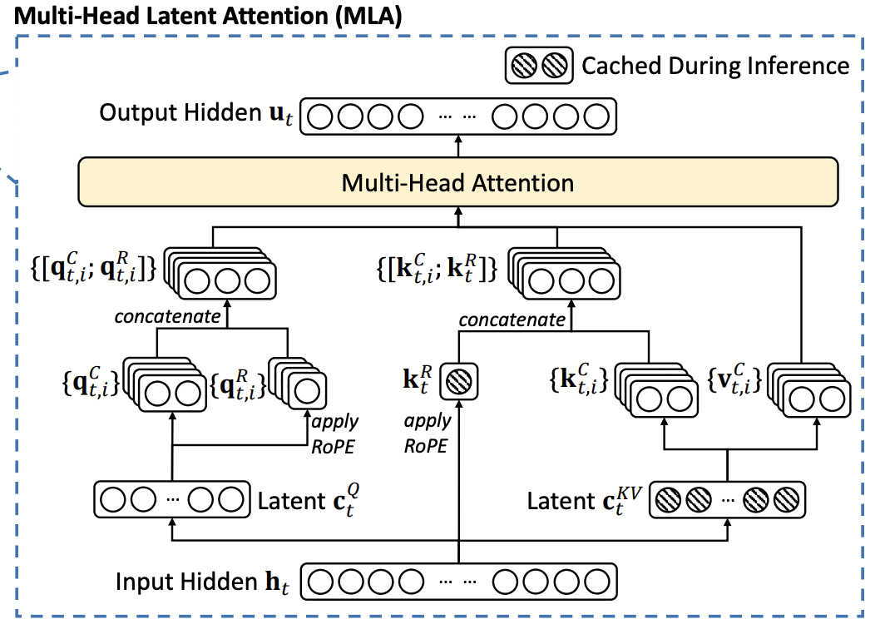
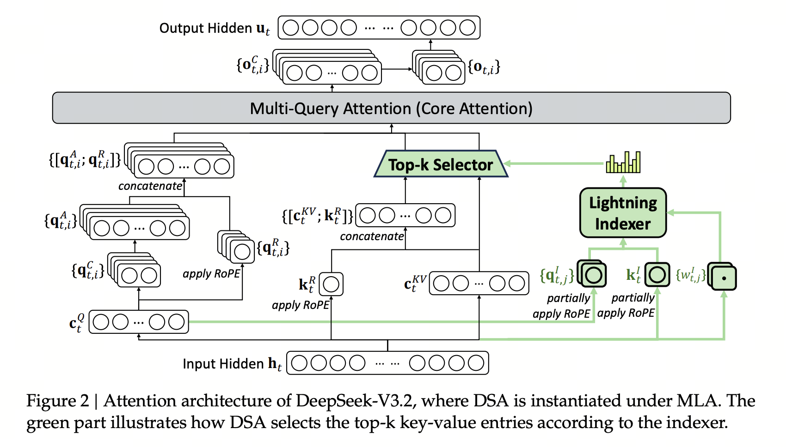
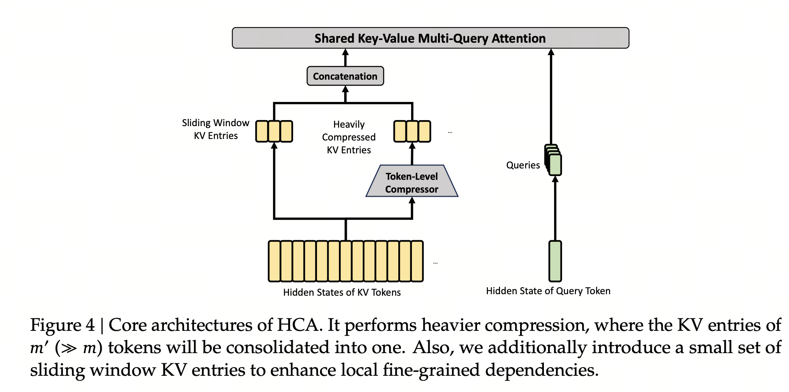
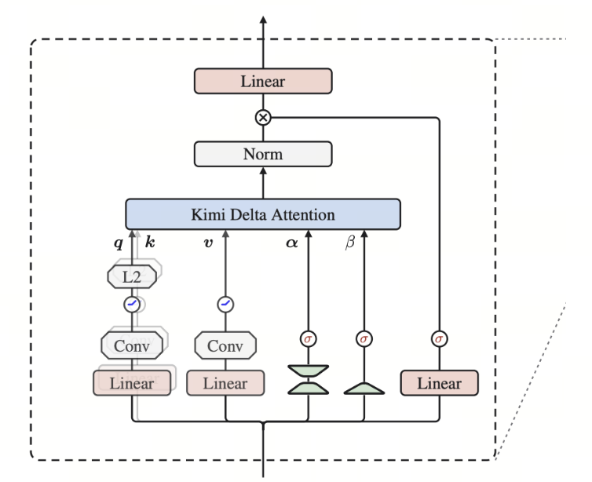

# Attention 架构笔记

## 一、Attention 架构与参数总览

| Model | Attention Mechanism | Heads / KV Representation | Head Dim | Layer Pattern |
| :--- | :--- | :--- | :--- | :--- |
| **Kimi K3** | Kimi Delta Attention + Gated MLA full attention | KDA：96 heads；MLA：96 Q heads，KV latent rank=512，Q latent rank=1536 | KDA：128；MLA：QK=128 + 64 但是都是NOPE 应该是为了 infra 保持了 MLA 的设计，V=128 | 93 层：69 KDA + 24 Gated MLA；大体为 3 KDA : 1 MLA，最后一层额外使用Gated MLA。 |
| **Qwen3.8-2.4T-A95B** | Gated DeltaNet linear attention + Gated Full Attention | DeltaNet：16 QK heads / 128 V heads；Full：64 Q / 4 KV | DeltaNet：128；Full：256，其中 RoPE 维度 64 | 92 层：23 × (3 DeltaNet + 1 Full)。 |
| **DeepSeek-V4-Pro** | CSA + HCA；Shared K=V MQA。CSA：4× overlapping learned KV compression + Lightning Indexer top-1024；HCA：128× non-overlap compression + dense attention；均附带 local SWA | 128 Q heads；1 shared K=V representation；Q latent rank=1536；Indexer=64 heads，top-k=1024；grouped output：16 groups / rank=1024 | 512 = 448 NoPE + 64 RoPE；Indexer=128 | 61 层：前2 HCA，之后 CSA/HCA 交替，共31 HCA + 30 CSA；所有层额外使用 window=128 local branch；另有1 MTP layer，仅 SWA |
| **GLM-5.3** | 继承 GLM-5.2 base 的 DSA on MLA，并使用 IndexShare | 64 Q heads；KV latent rank=512；Q latent rank=2048；Indexer：32 heads；Sparse top-k=2048 | QK=192 NoPE + 64 RoPE；V=256；Indexer=128 | 78 层；均为 DSA/MLA；前三层各自运行 Indexer，之后基本为 1 Full Indexer + 3 Shared，后 3 层复用同一 top-k indices。 |
| **MAI-Thinking-1** | GQA；Sliding Window + Full Attention | 80 Q / 8 KV | 128 | 78 层：5 Local + 1 Global，即 65 Local + 13 Global；Local window=512。Local 使用 RoPE，Global 完全 NoPE。 |
| **TML Inkling** | GQA；Sliding Window + Full Attention| Global：64 Q / 8 KV；Local：64 Q / 16 KV | 128；Relative-position dim=16 （position的故事我们之后再聊）, QK logits scale 使用 1/d (好神奇)| 66 层 = 11 × (5 Local + 1 Global)，55 Local + 11 Global；window=512；每层 K/V projection 后及 Attention/MLP residual branch 输出处使用 kernel=4 Conv |
| **MiMo-V2.5-Pro** | GQA；Sliding Window + Full Attention | 128 Q / 8 KV | QK=192；V=128, Q/K 使用 Partial RoPE：64-d RoPE + 128-d NoPE, V 固定乘 0.612（应该来自 \(\approx \sqrt{\frac{6144}{128 \times 128}}\)） | 70 层：60 SWA + 10 Full，即 6 Local : 1 Full；window=128；SWA 额外加入 per-head attention-sink bias，使注意力可以将无用概率质量分配给这个 bias 并丢掉。 |
| **MiniMax-M3** | MSA：GQA 上的 blockwise sparse attention；每个 GQA group 独立进行 block retrieval | 64 Q / 4 KV；Indexer：4 Q heads，共享 Index K |Attention=128 = 64 RoPE + 64 NoPE；Indexer=128 | 60 层：前 3 层 Full GQA，后 57 层 MSA。每个 query group 选择 top-16 个、每个 128-token 的 block，即约 2048 tokens，并强制包含 local block。 |
| **LongCat-2.0** | LSA on MLA：先、固定选 (16 sink + 1024 local window); 先按 block 粗筛然后在候选 block 内选 token；相邻 2 层共享一次 Index | 64 Q heads；KV latent rank=512；Q latent rank=1536；Indexer：32 heads；top-k=2048 | QK=128 NoPE + 64 RoPE；V=128；Indexer=128 | 38 层；相邻两层共享索引。 |
| **Hy3** | GQA | 64 Q / 8 KV | 128 | 80 层 GQA |
| **DeepSeek-V3** | MLA | 128 Q heads；KV latent rank=512；Q latent rank=1536 | QK=128 NoPE + 64 RoPE；V=128 | 61 MLA |
| **Gemma 4** | GQA；Local/Global Hybrid；所有 Global 层使用 p-RoPE；12B/26B/31B 的 Global 层使用 K=V；E2B/E4B 使用 cross-layer KV sharing | E2B：8Q/1KV；E4B：8Q/2KV；12B：16Q，Local 8KV / Global 1KV；26B-A4B：16Q，Local 8 / Global 2；31B：32Q，Local 16 / Global 4 | Local=256，全维 RoPE；Global=512，其中 128 RoPE + 384 NoPE | E2B：35 层，4L:1G，window=512；E4B：42 层，5:1，window=512；12B：48 层、26B：30 层、31B：60 层，均 5:1、window=1024；所有型号最后一层为 Global |

## 二、Attention 机制概讲


### MLA



MHA GQA MQA 都很一目了然我们边不过多介绍，下面我们来具体聊一下 MLA

一段话来说呢，就是：

**MLA（Multi-Head Latent Attention）的核心是用一个低维 latent 压缩所有 head 的 KV，同时保留多头不同的表达能力：输入 \(h_t\) 先下投影得到共享的低维 \(c_t^{KV}\)（DeepSeek-V3 中为 512-d），再通过不同的上投影展开成各个 head 的 \(k^C_{t,i},v^C_{t,i}\)；Q 侧类似先得到 \(c_t^Q\)，再展开成各 head 的 \(q^C_{t,i}\)。由于 RoPE 会破坏这种低秩矩阵的 matrix absorption，MLA 把位置编码单独放到一个较小的 RoPE 子空间 \(q^R_{t,i},k_t^R\)（如 64-d），最终 \(Q_i=[q^C_i;q^R_i]\)、\(K_i=[k^C_i;k^R]\)。训练时可以看成把 latent 展开成每个 head 不同的 K/V，获得接近 MHA 的表达能力；Decode 时利用 matrix absorption 不必保存/展开历史的完整多头 KV，只缓存 \(c_t^{KV}+k_t^R\)，因此 KV Cache 从 \(O(Hd)\) 降到 \(O(d_{\text{latent}}+d_R)\)，大幅降低显存和解码带宽。**

用苏神的话来说呢，就是：

1. MLA 在训练阶段是一个 `qk_head_dims=(128+64)`、`v_head_dims=128` 的 MHA；

2. MLA 在解码阶段是一个 `qk_head_dims=(512+64)`、`v_head_dims=512`、KV-Shared 的 MQA。

### DSA



**DSA（DeepSeek Sparse Attention）可以理解为在真正的 MLA Attention 前加一个轻量的 Lightning Indexer 做 token 路由：对当前 token 的 hidden state \(x_t\) 生成 64 个 128-d Indexer Query \(Q_I\)，每个历史 token \(x_s\) 生成一个共享的 128-d Indexer Key** \(K_I\)；64 个 Query 分别与全部历史 Key 做点积，经 ReLU 后，再用当前 token 生成的 64 个 head weight 加权汇总，得到每个历史 token 唯一的 relevance score \(I_t[s]\)，然后 **Top-K 选出最相关的 2048 个历史 token**。Indexer 本身只负责“哪些 token 值得看”，真正的 attention 仍由 MLA 完成，但 MLA 不再对全部长度 \(L\) 的 KV 做 attention，而只对选中的 2048 个 KV 做精确 attention，因此把核心 Attention 的复杂度从随上下文长度 \(L\) 增长，压到近似固定的 Top-K；

我承认我最开始是对于 DSA 有着一些误解的，我认为 DSA 会导致 Infra 非常难堪，但是今天下午经一位 Infra 群的大佬指教后我才恍然大悟，DSA 搭配 MLA 真的是非常奇妙：

**DSA 的 per-query、fine-grained token Top-K 使传统沿 `Q-token × K-token` 的规则 attention tiling 难以直接使用：相邻 Q token 往往选择不同、离散的 K token 集合，因此无法让一块 Q tokens 共享同一块连续 K tile。MLA 则在 matrix-absorbed 的 MQA mode 下，让同一个 latent KV entry 被当前 token 的所有 query heads 共享，于是 kernel 可以改为沿 `query-head × selected-K` 组织计算，用多个 query heads 提供 Tensor Core 所需的规则矩阵维度，同时复用一次加载的 KV。**

不得不再对 DeepSeek 团队的巧思五体投地的佩服。

DSA 的训练上，一般是从一个比较成熟的权重开始训练（DS3.2 是从 3.1 上训，GLM 是从 Mid-Train 开始训），然后分为两个阶段：

简单来讲：

1. **Dense 预热阶段**：保持主模型的 Dense Attention 不变，只训练 Indexer；用主 Attention 在**全序列上的注意力分布**作为 teacher，通过 KL loss 让 Indexer 学会在全局范围内准确判断哪些历史 token 更重要。

2. **Sparse 训练阶段**：启用 Top-K 稀疏选择并继续训练整个模型；Indexer 仍然对齐主 Attention，但只在**已经选中的 token 集合内部**计算 KL，使 Indexer 学会把这些候选 token 的相对重要性和排序估得更准，同时主模型逐渐适应 Sparse Attention 的计算模式。

### HCA/CSA

最复杂的一集来啦……


CSA（Compressed Sparse Attention）可以概括为：**先用 learned compressor 对远距离 token 做 4:1 的可学习压缩，再用 Lightning Indexer 从压缩后的 KV 中做 Top-K 稀疏检索，最后与最近 128 个未压缩的 local raw KV 一起做 core attention。**

其中 learned compressor 对每个 token 分别投影出 content 和逐-channel gate，对每个 channel 在一组 token 上做 softmax，再逐 channel 加权汇聚，得到一个 compressed KV；CSA 使用 **overlapping compression**：每个 compressed KV 覆盖连续 8 个原始 token，但压缩窗口每次只向前移动 4 个 token，因此相邻两个 compressed KV 会共享中间 4 个 token。在此之上 Lightning Indexer 会对这些 compressed KV 打分并只选择 Top-K（V4-Pro 为 1024）进入真正的 attention；同时最近 128 个 token 保留原始 KV，以保留局部细粒度信息。最终 core attention 使用 Shared-KV MQA，多组 Q head 共享同一套 KV，并采用 \(K=V\)。



HCA（Heavily Compressed Attention）：用 learned compressor 将远距离 token 做 128:1 的 non-overlapping 压缩，然后直接对全部 compressed KV 做 dense attention，不再使用 Lightning Indexer 或 Top-K；同时保留最近 128 个 raw KV 参与 dense attention。

\clearpage

### Gated DeltaNet

{width=80%}

**Gated DeltaNet** 用固定大小的 recurrent state \(S_t\) 压缩历史信息：输入投影得到 \(q,k,v,\alpha,\beta\)，之后，q,k,v 先经过短卷积，\(q,k\) 再做 L2 Norm；α 由 Linear 后经过一系列操作（我把代码贴下面了）映射到 \((0,1]\)，是 **per-head scalar retention gate**，控制旧状态保留多少；\(\beta=\sigma(W_\beta x_t)\) 也是 **per-head scalar**，控制当前 Delta update 的强度。Delta Rule 根据当前 key 下的预测误差 \(v_t-S^\top k_t\) 修正状态；随后用 \(q_t\) 从状态读出结果，经过 Zero-Centered RMSNorm、output gate（出自 Gated Attention，伟大无需多言）和 Linear 得到输出。**核心就是：\(\alpha\) 控制遗忘，\(\beta\) 控制写入，Delta Rule 用预测误差更新记忆。**

```text
# Qwen / Gated DeltaNet
a = a_proj(x)                  # [B,T,H] 当前 token 为每个 head 生成 decay logit
z = a + dt_bias               # [B,T,H] 加每个 head 的可学习 decay bias
A = exp(A_log)                # [H] 每个 head 的基础遗忘速度
g = -A * softplus(z)          # [B,T,H] log-decay，保证 g < 0
alpha = exp(g)                # [B,T,H] 真正保留率，0 < α <= 1
S = alpha * S                 # 每个 head 的整个 state 使用同一个 α 衰减
```

\clearpage

### Kimi Linear



**Kimi Delta Attention（KDA）**整体框架和 Gated DeltaNet 很接近：同样用固定大小的 recurrent state \(S_t\) 压缩历史信息，输入 \(x_t\) 投影得到 \(q,k,v,\alpha,\beta\)，Q/K/V 经过 short conv，\(q,k\) 再做 L2 Norm；\(\beta=\sigma(W_\beta x_t)\) 仍然是 **per-head scalar**，控制当前 Delta update 的强度。**KDA 最核心的改动在 \(\alpha\)（代码同样附下）**：Gated DeltaNet 每个 head、每个 token 只有一个 scalar \(\alpha_t\)，整个 state 一起衰减；KDA 则由 \(x_t\) 通过额外的 fine-grained gating projection 生成一个 **per-channel 向量 \(\boldsymbol{\alpha}_t\)**，用 \(\mathrm{Diag}(\boldsymbol{\alpha}_t)\) 对 state 的不同 key/memory channel 分别控制遗忘。状态更新仍采用 Delta Rule，根据 \(v_t-S^\top k_t\) 的预测误差，以 \(\beta\) 控制强度修正 state，之后用 \(q_t\) 读取 state，再经 RMSNorm、output gate 和 Linear 得到输出。

```python
# Kimi K3 / KDA
z = f_proj(x) + dt_bias       # [B,T,H,K] 每个 head 的每个 key channel 都生成 decay logit
A = exp(A_log)                # [H] 每个 head 的整体 decay scale
g = -5 * sigmoid(A[...,None] * z)  # [B,T,H,K] bounded log-decay，-5 < g < 0
alpha = exp(g)                # [B,T,H,K] 每个 key channel 一个独立保留率
S = alpha[..., :, None] * S   # 等价于 Diag(α) @ S，不同 memory channel 分别遗忘
```
