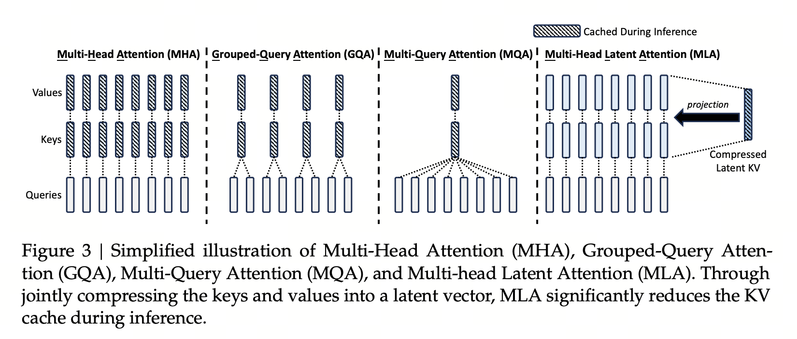
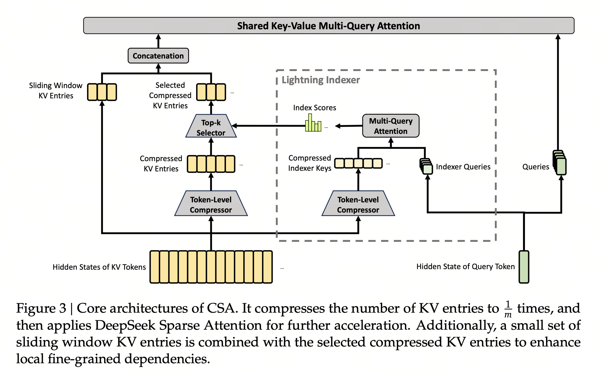
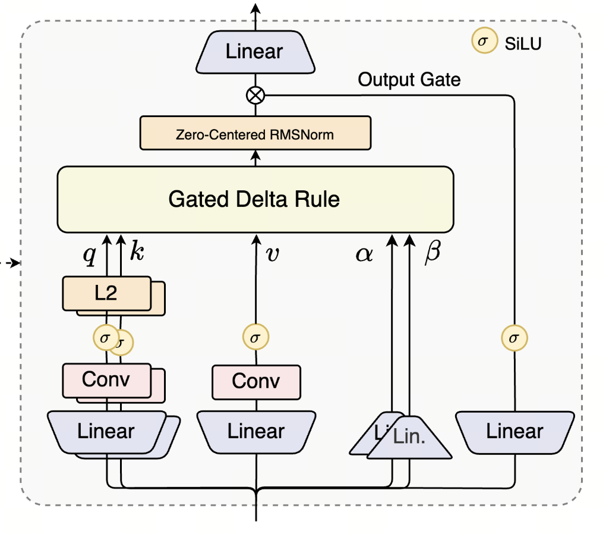

# Attention Architecture Notes

## I. Overview of Attention Architectures and Parameters

| Model | Attention Mechanism | Heads / KV Representation | Head Dim | Layer Pattern |
| :--- | :--- | :--- | :--- | :--- |
| **Kimi K3** | Kimi Delta Attention + Gated MLA full attention | KDA: 96 heads; MLA: 96 Q heads, KV latent rank=512, Q latent rank=1536 | KDA: 128; MLA: QK=128 + 64, but both are NoPE; this likely retains the MLA design for infrastructure compatibility, V=128 | 93 layers: 69 KDA + 24 Gated MLA; broadly 3 KDA : 1 MLA, with an additional Gated MLA in the final layer. |
| **Qwen3.8-2.4T-A95B** | Gated DeltaNet linear attention + Gated Full Attention | DeltaNet: 16 QK heads / 128 V heads; Full: 64 Q / 4 KV | DeltaNet: 128; Full: 256, including 64 RoPE dimensions | 92 layers: 23 × (3 DeltaNet + 1 Full). |
| **DeepSeek-V4-Pro** | CSA + HCA; Shared K=V MQA. CSA: 4× overlapping learned KV compression + Lightning Indexer top-1024; HCA: 128× non-overlapping compression + dense attention; both include local SWA | 128 Q heads; 1 shared K=V representation; Q latent rank=1536; Indexer=64 heads, top-k=1024; grouped output: 16 groups / rank=1024 | 512 = 448 NoPE + 64 RoPE; Indexer=128 | 61 layers: the first 2 are HCA, followed by alternating CSA/HCA, for a total of 31 HCA + 30 CSA; every layer additionally uses a local branch with window=128; there is also 1 MTP layer using SWA only |
| **GLM-5.3** | Inherits DSA on MLA from the GLM-5.2 base and uses IndexShare | 64 Q heads; KV latent rank=512; Q latent rank=2048; Indexer: 32 heads; Sparse top-k=2048 | QK=192 NoPE + 64 RoPE; V=256; Indexer=128 | 78 layers, all DSA/MLA; the first three layers each run their own Indexer, after which the pattern is essentially 1 Full Indexer + 3 Shared, and the final 3 layers reuse the same top-k indices. |
| **MAI-Thinking-1** | GQA; Sliding Window + Full Attention | 80 Q / 8 KV | 128 | 78 layers: 5 Local + 1 Global, i.e., 65 Local + 13 Global; Local window=512. Local uses RoPE, while Global is entirely NoPE. |
| **TML Inkling** | GQA; Sliding Window + Full Attention | Global: 64 Q / 8 KV; Local: 64 Q / 16 KV | 128; Relative-position dim=16 (we will discuss the position story later), QK logits scale uses 1/d (fascinating) | 66 layers = 11 × (5 Local + 1 Global), 55 Local + 11 Global; window=512; every layer uses kernel=4 Conv after the K/V projections and at the outputs of the Attention/MLP residual branches |
| **MiMo-V2.5-Pro** | GQA; Sliding Window + Full Attention | 128 Q / 8 KV | QK=192; V=128; Q/K use Partial RoPE: 64-d RoPE + 128-d NoPE; V is multiplied by a fixed 0.612 (likely from \(\approx \sqrt{\frac{6144}{128 \times 128}}\)) | 70 layers: 60 SWA + 10 Full, i.e., 6 Local : 1 Full; window=128; SWA additionally introduces a per-head attention-sink bias, allowing attention to assign useless probability mass to this bias and discard it. |
| **MiniMax-M3** | MSA: blockwise sparse attention on GQA; each GQA group performs block retrieval independently | 64 Q / 4 KV; Indexer: 4 Q heads, shared Index K | Attention=128 = 64 RoPE + 64 NoPE; Indexer=128 | 60 layers: the first 3 layers use Full GQA, and the remaining 57 use MSA. Each query group selects the top 16 blocks of 128 tokens each, i.e., about 2,048 tokens, with the local block forcibly included. |
| **LongCat-2.0** | LSA on MLA: first, fixed selection of (16 sink + 1,024 local window); blocks are first coarsely filtered, then tokens are selected within candidate blocks; two adjacent layers share one Index | 64 Q heads; KV latent rank=512; Q latent rank=1536; Indexer: 32 heads; top-k=2048 | QK=128 NoPE + 64 RoPE; V=128; Indexer=128 | 38 layers; every two adjacent layers share an index. |
| **Hy3** | GQA | 64 Q / 8 KV | 128 | 80 GQA layers |
| **DeepSeek-V3** | MLA | 128 Q heads; KV latent rank=512; Q latent rank=1536 | QK=128 NoPE + 64 RoPE; V=128 | 61 MLA layers |
| **Gemma 4** | GQA; Local/Global Hybrid; all Global layers use p-RoPE; the Global layers of the 12B/26B/31B models use K=V; E2B/E4B use cross-layer KV sharing | E2B: 8Q/1KV; E4B: 8Q/2KV; 12B: 16Q, Local 8KV / Global 1KV; 26B-A4B: 16Q, Local 8 / Global 2; 31B: 32Q, Local 16 / Global 4 | Local=256, full-dimensional RoPE; Global=512, including 128 RoPE + 384 NoPE | E2B: 35 layers, 4L:1G, window=512; E4B: 42 layers, 5:1, window=512; 12B: 48 layers, 26B: 30 layers, and 31B: 60 layers, all 5:1 with window=1024; the final layer is Global in every model |

## II. Overview of Attention Mechanisms



### MLA


MHA, GQA, and MQA are all straightforward, so we will not dwell on them. Let us take a closer look at MLA.

In one paragraph:

**The core idea of MLA (Multi-Head Latent Attention) is to compress the KV of all heads into one low-dimensional latent representation while preserving the distinct expressive capacity of multiple heads: the input \(h_t\) is first down-projected into a shared low-dimensional \(c_t^{KV}\) (512-d in DeepSeek-V3), then expanded through different up-projections into \(k^C_{t,i},v^C_{t,i}\) for each head; the Q side similarly produces \(c_t^Q\) first and then expands it into \(q^C_{t,i}\) for each head. Because RoPE breaks the matrix absorption of this low-rank matrix, MLA places positional encoding separately in a smaller RoPE subspace \(q^R_{t,i},k_t^R\) (e.g., 64-d), giving \(Q_i=[q^C_i;q^R_i]\) and \(K_i=[k^C_i;k^R]\). During training, this can be viewed as expanding the latent representation into distinct K/V for each head, achieving expressive capacity close to MHA; during decoding, matrix absorption eliminates the need to store or expand the full historical multi-head KV, so only \(c_t^{KV}+k_t^R\) is cached. The KV Cache therefore falls from \(O(Hd)\) to \(O(d_{\text{latent}}+d_R)\), substantially reducing memory usage and decoding bandwidth.**

In Su's words:

1. During training, MLA is an MHA with `qk_head_dims=(128+64)` and `v_head_dims=128`;

2. During decoding, MLA is a KV-shared MQA with `qk_head_dims=(512+64)` and `v_head_dims=512`.

### DSA


**DSA (DeepSeek Sparse Attention) can be understood as adding a lightweight Lightning Indexer for token routing before the actual MLA Attention: for the current token's hidden state \(x_t\), it generates 64 128-d Indexer Queries \(Q_I\), while each historical token \(x_s\) produces one shared 128-d Indexer Key** \(K_I\). The 64 Queries separately take dot products with all historical Keys; after ReLU, the results are weighted and aggregated using 64 head weights generated from the current token, producing a single relevance score \(I_t[s]\) for every historical token. It then **selects the 2,048 most relevant historical tokens via Top-K**. The Indexer itself only decides “which tokens are worth attending to”; the actual attention is still performed by MLA. However, MLA no longer attends to the KV of the entire length \(L\), but performs exact attention only over the selected 2,048 KV entries, thereby reducing the complexity of the core Attention from growth with context length \(L\) to an approximately fixed Top-K.

I admit that I initially misunderstood DSA. I thought it would make the infrastructure extremely awkward, but after receiving guidance from an expert in an infrastructure group this afternoon, I suddenly realized that pairing DSA with MLA is truly ingenious:

**DSA's per-query, fine-grained token Top-K makes it difficult to directly use conventional regular attention tiling along `Q-token × K-token`: adjacent Q tokens often select different, discrete sets of K tokens, so a block of Q tokens cannot share the same contiguous K tile. In MLA's matrix-absorbed MQA mode, however, the same latent KV entry is shared by all query heads of the current token. The kernel can therefore organize computation along `query-head × selected-K`, using multiple query heads to provide the regular matrix dimensions required by Tensor Cores while reusing the KV loaded once.**

Once again, I cannot help but admire the ingenuity of the DeepSeek team.

DSA training generally starts from fairly mature weights (DS3.2 was trained from 3.1, while GLM began training from Mid-Train) and then proceeds in two stages:

In simple terms:

1. **Dense warm-up stage**: keep the main model's Dense Attention unchanged and train only the Indexer; use the main Attention's **attention distribution over the full sequence** as the teacher, and train the Indexer with KL loss to accurately determine which historical tokens are more important globally.

2. **Sparse training stage**: enable Top-K sparse selection and continue training the entire model; the Indexer remains aligned with the main Attention, but KL is computed only **within the already selected token set**, teaching the Indexer to estimate the relative importance and ranking of these candidate tokens more accurately, while the main model gradually adapts to the Sparse Attention computation pattern.

### HCA/CSA

Here comes the most complicated installment...



CSA (Compressed Sparse Attention) can be summarized as follows: **first use a learned compressor to perform learnable 4:1 compression of long-range tokens, then use a Lightning Indexer to perform Top-K sparse retrieval from the compressed KV, and finally perform core attention together with the most recent 128 uncompressed local raw KV entries.**

The learned compressor separately projects content and a per-channel gate for each token, applies softmax over a group of tokens for every channel, and then performs a channel-wise weighted aggregation to obtain one compressed KV. CSA uses **overlapping compression**: each compressed KV covers 8 consecutive original tokens, but the compression window advances by only 4 tokens each time, so two adjacent compressed KV entries share the middle 4 tokens. On top of this, the Lightning Indexer scores these compressed KV entries and selects only the Top-K (1,024 for V4-Pro) for the actual attention; meanwhile, the most recent 128 tokens retain their raw KV to preserve fine-grained local information. The final core attention uses Shared-KV MQA, in which multiple groups of Q heads share the same KV and \(K=V\).


HCA (Heavily Compressed Attention): a learned compressor performs 128:1 non-overlapping compression on long-range tokens, after which dense attention is applied directly to all compressed KV entries without a Lightning Indexer or Top-K; the most recent 128 raw KV entries are retained and also participate in dense attention.

\clearpage

### Gated DeltaNet

{width=80%}

**Gated DeltaNet** compresses historical information into a fixed-size recurrent state \(S_t\): input projections produce \(q,k,v,\alpha,\beta\); q, k, and v first pass through short convolutions, after which \(q,k\) undergo L2 Norm. Following a Linear layer and a series of operations (the code is included below), α is mapped to \((0,1]\). It is a **per-head scalar retention gate** that controls how much of the old state is retained; \(\beta=\sigma(W_\beta x_t)\) is also a **per-head scalar** and controls the strength of the current Delta update. The Delta Rule corrects the state according to the prediction error \(v_t-S^\top k_t\) under the current key; \(q_t\) then reads the result from the state, followed by Zero-Centered RMSNorm, an output gate (from Gated Attention; greatness speaks for itself), and a Linear layer to produce the output. **The essence is: \(\alpha\) controls forgetting, \(\beta\) controls writing, and the Delta Rule updates memory using the prediction error.**

```text
# Qwen / Gated DeltaNet
a = a_proj(x)                  # [B,T,H] current token generates a decay logit for each head
z = a + dt_bias               # [B,T,H] add the learnable decay bias for each head
A = exp(A_log)                # [H] base forgetting rate for each head
g = -A * softplus(z)          # [B,T,H] log-decay, ensuring g < 0
alpha = exp(g)                # [B,T,H] actual retention rate, 0 < α <= 1
S = alpha * S                 # each head uses the same α to decay its entire state
```

\clearpage

### Kimi Linear


The overall framework of **Kimi Delta Attention (KDA)** is very similar to Gated DeltaNet: it likewise compresses historical information into a fixed-size recurrent state \(S_t\), and projects the input \(x_t\) into \(q,k,v,\alpha,\beta\). Q/K/V pass through short conv, after which \(q,k\) undergo L2 Norm; \(\beta=\sigma(W_\beta x_t)\) remains a **per-head scalar** that controls the strength of the current Delta update. **KDA's central modification lies in \(\alpha\) (the code is likewise included below)**: Gated DeltaNet has only one scalar \(\alpha_t\) per head and token, so the entire state decays together; KDA instead uses an additional fine-grained gating projection from \(x_t\) to generate a **per-channel vector \(\boldsymbol{\alpha}_t\)**, using \(\mathrm{Diag}(\boldsymbol{\alpha}_t)\) to control forgetting separately for different key/memory channels of the state. The state update still uses the Delta Rule, correcting the state according to the prediction error \(v_t-S^\top k_t\), with \(\beta\) controlling the strength. The state is then read using \(q_t\), followed by RMSNorm, an output gate, and a Linear layer to produce the output.

```python
# Kimi K3 / KDA
z = f_proj(x) + dt_bias       # [B,T,H,K] generate a decay logit for every key channel of each head
A = exp(A_log)                # [H] overall decay scale for each head
g = -5 * sigmoid(A[...,None] * z)  # [B,T,H,K] bounded log-decay, -5 < g < 0
alpha = exp(g)                # [B,T,H,K] independent retention rate for every key channel
S = alpha[..., :, None] * S   # equivalent to Diag(α) @ S; different memory channels forget separately
```
