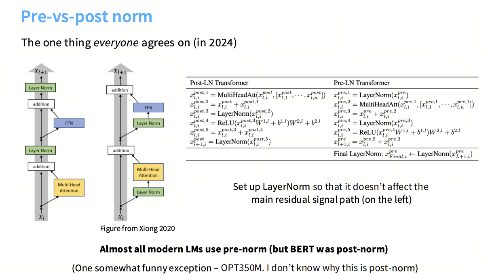
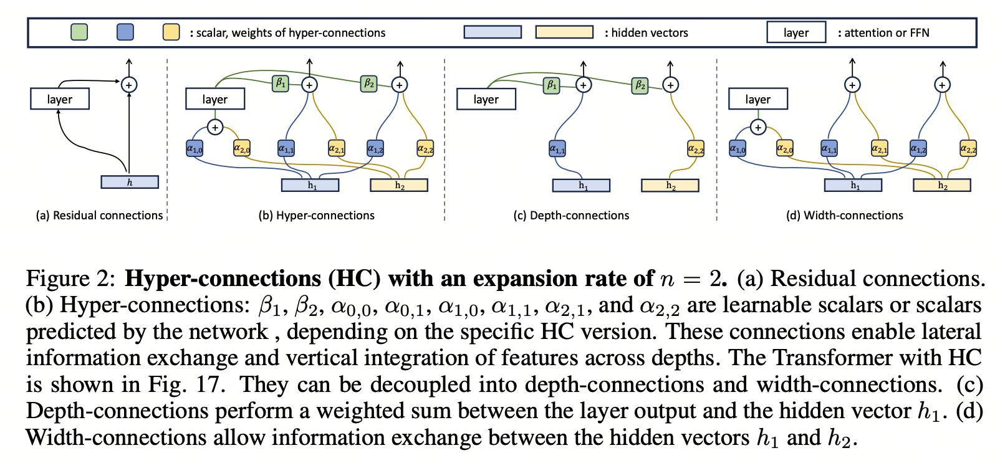
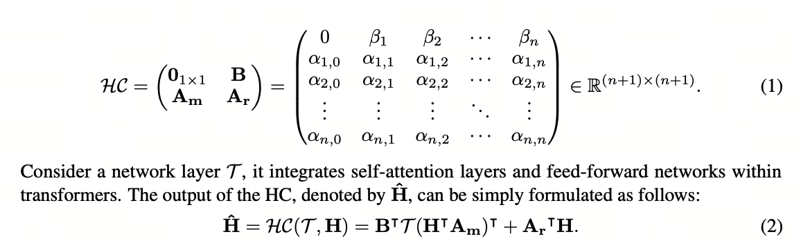
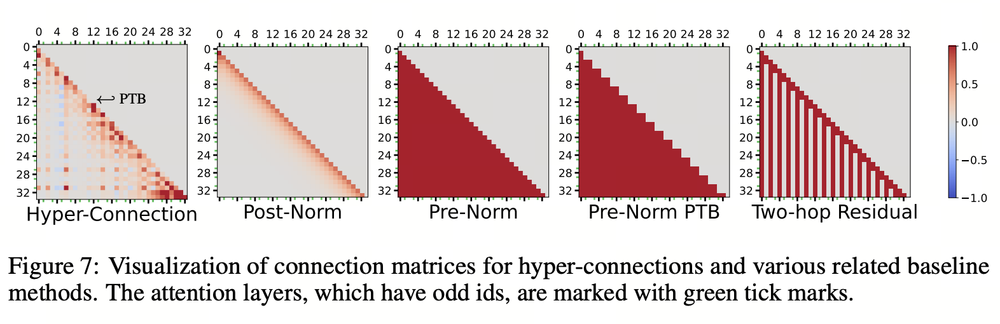
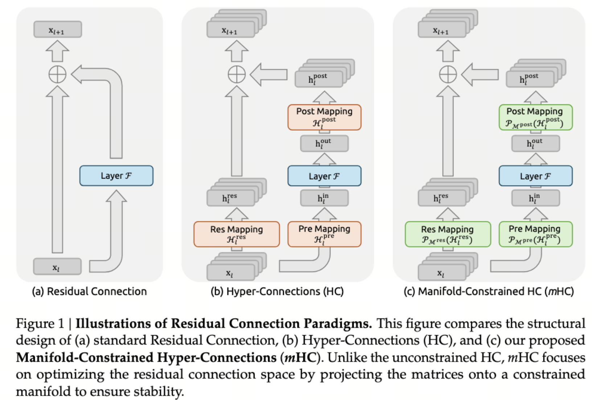
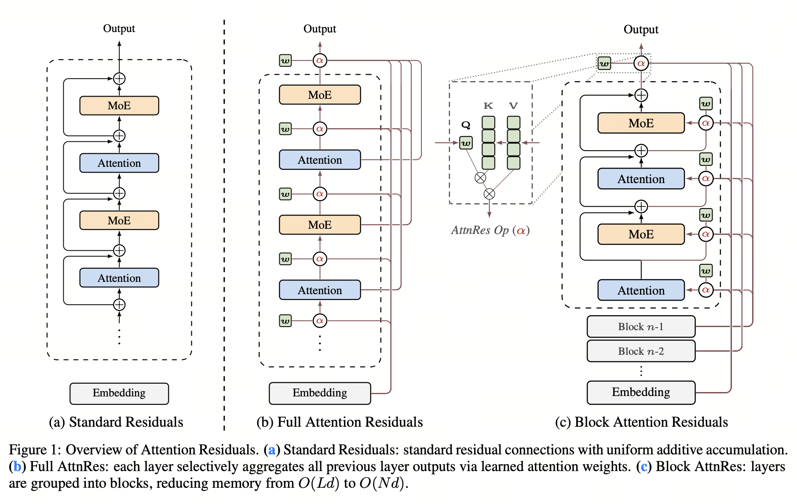
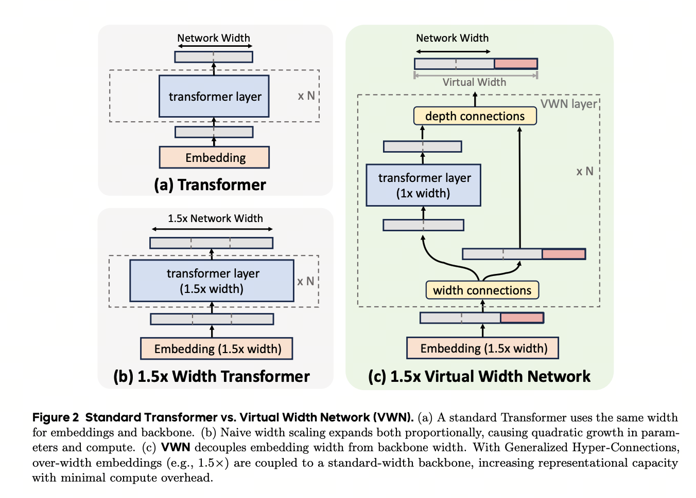
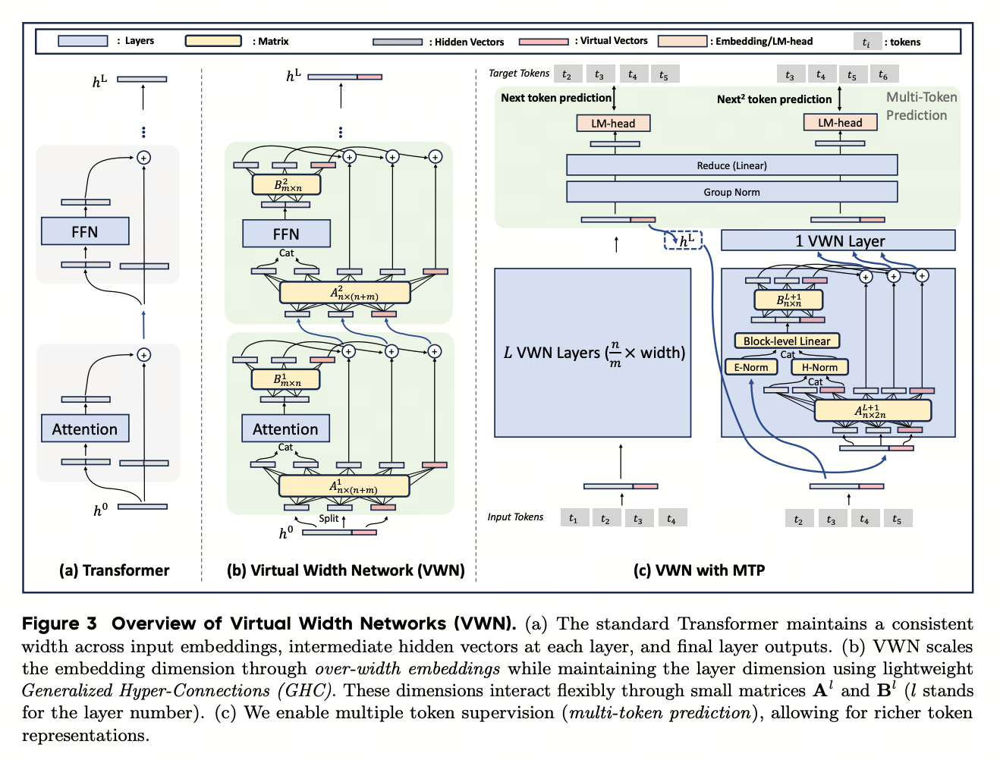

# Beyond Residual Connection

::: {#residual-overview}

| 类型 | 简化结构 | 核心思想 | 动态性 / 约束 | 代表模型 |
| :--- | :--- | :--- | :--- | :--- |
| **PreNorm** | $x'=x+F(\mathrm{Norm}(x))$ | 单一路 residual stream，固定 identity shortcut 累加各层输出 | 固定 Identity；无可学习 residual mixing | 除下列模型外的绝大多数模型 |
| **HC** | $\begin{aligned}R'&=H_{\mathrm{res}}\cdot R\\&\quad+H_{\mathrm{post}}\cdot F(H_{\mathrm{pre}}\cdot R)\end{aligned}$ | 将单路 residual 扩展为多路 residual streams，同时学习 Read、Write 和 residual mixing | $H_{\mathrm{res}}$ 为可学习、data-dependent 的残差混合矩阵；自由度高，但深层训练容易不稳定 | HC |
| **mHC** | $H'_{\mathrm{res}}=\operatorname{Sinkhorn\text{-}Knopp}(H_{\mathrm{res}})$ | 在 HC 基础上约束 residual mixing，使多路 residual 在深层网络中保持稳定 | **双随机矩阵解决 HC 深层训练不稳定** | DeepSeek-V4-Pro、DeepSeek-V4.1-Flash |
| **iHC** | $H_{\mathrm{res}}=I$ | **把 mHC 的双随机矩阵直接改为单位矩阵**，保留多路 residual 的 Read / Write 能力 | $H_{\mathrm{res}}=I$；固定 identity residual mixing | HY4-Preview |
| **GR** | $H_{\mathrm{res}}=I$ + channel 粒度 Read | **channel 粒度 Read**；通过 gate 动态控制 sublayer 从 residual stream 中读取的信息 | $H_{\mathrm{res}}=I$，**element-wise、data-dependent read gate** | Qwen3.8-Flash-Next |
| **AttnRes** | $h_l=\sum_i\alpha_{i\to l}\cdot v_i$，$\alpha=\mathrm{softmax}(q_l\cdot k_i)$ | 将传统 residual 的固定累加改为对历史层 / Block 表示进行 Attention，根据当前层需求选择需要保留的信息 | 沿 depth 进行 softmax 加权；K3 使用 Block AttnRes 降低开销 | Kimi K3 |

:::

残差连接可以称得上撑起了深度学习的“深度”的伟大里程碑，而在近年，四处改良 Transformer 的大家终于磨刀霍霍向残差了。

## 一、从 Pre-Norm 与 Post-Norm 说起

万恶的起源在 Pre-Norm 和 Post-Norm 之争。简而言之呢：

**Pre-Norm**：在每个残差分支之前进行归一化，即先做 Norm，再进入 Attention 或 FFN 等子层。

**Post-Norm**：在残差连接之后进行归一化，即先完成子层计算与残差相加，再做 Norm。

目前的大语言模型大多采用 **Pre-Norm** 结构。一个重要原因是，Pre-Norm 为残差主干提供了一条更直接的梯度传播路径，使深层 Transformer 的训练更加稳定，能够有效缓解梯度消失或梯度爆炸等问题，因此更容易扩展到几十层甚至上百层。

不过，Pre-Norm 也存在一定的局限性。由于其残差形式可以近似写成：

$$
x_{l+1}=x_l+F\!\left(\mathrm{Norm}(x_l)\right).
$$

随着网络不断加深，表示中会持续累积此前各层的残差信息。此时，后续单层所引入的增量相对于已经累积起来的主干表示可能越来越小，因此相邻深层之间的表示变化会逐渐减弱。

换句话说，虽然模型在物理结构上增加了很多层，但这些新增层未必都能带来同等程度的表征变换。网络的实际有效深度可能低于其名义深度。

正如 kexue.fm 曾言：**Pre-Norm 在某种意义上“增加了模型的宽度，却降低了模型的深度”。**

因此，Pre-Norm 与 Post-Norm 本质上体现了一种权衡：

**Pre-Norm 更容易优化、训练更稳定，但可能牺牲一部分深度带来的表征能力；Post-Norm 理论上能够保持更强的逐层变换能力，但深层网络的优化难度更高。**

于是，就出现了一系列文章致力于解决这个问题，其中我认为最棒的一条路线，正是 Hyper-connections。

## 二、HC

HC 的做法可以概括为：**先把原来的 hidden state 复制成 $n$ 条并行的 hidden stream，然后每一层用 $A_m$ 把这 $n$ 条信息加权混合成一条，送进正常的 Attention/FFN（只计算一次）；得到新的 layer output 后，再用 $B$ 把这份新信息按不同权重写回到 $n$ 条 stream，同时用 $A_r$ 对原来的 $n$ 条 stream 做残差保留和相互混合，最终得到新的 $n$ 条 hidden state 继续传到下一层。本质上就是把传统固定的 residual connection，变成了一个可学习的多通道信息路由机制**。
通俗来讲就是，维护 $n$ 条信息流，分别考虑这一层读哪几条、算出来之后写到哪几条、旧信息怎么继续往后传。

文章 Section 4.5 也做了一些非常精彩的可视化分析（也许就是HC带的，后继者总会做同样的可视化与分析，非常好的风气！强烈推荐大家阅读原文呀）

我在这里摘录一些结论：

- 展开后的有效连接矩阵显示，HC 会同时学到：

    - **局部强连接**：更依赖最近几层，类似 Post-Norm；

    - **少量长程直连**：保留关键早层信息，类似 Pre-Norm。

- 两者结合得到：**大部分信息短程更新 + 少数重要信息长期保留**。

- 某些相邻层之间连接接近 0，说明模型会自发形成近似 **Parallel Transformer Block（即attention和FFN并行，参考图示锯齿状部分）。**

- Attention 输出更偏局部使用，FFN 输出更容易形成长程连接。

- $n=1$ 时，很难同时做到“局部更新”和“长期保留”；而 $n>1$ 的多 stream 结构，可以让不同 stream 分别承担这两类任务。

## 三、mHC

对于多层 HC，展开以后，浅层信号必须经过：

$$
\prod_{i=1}^{L-l}\mathcal{H}_{L-i}^{\mathrm{res}}
$$

才能传播到第 $L$ 层。完整表达式为：

$$
\mathbf{x}_L=
\left(
\prod_{i=1}^{L-l}\mathcal{H}_{L-i}^{\mathrm{res}}
\right)\mathbf{x}_l
+
\sum_{i=l}^{L-1}
\left(
\prod_{j=1}^{L-1-i}\mathcal{H}_{L-j}^{\mathrm{res}}
\right)
\mathcal{H}_i^{\mathrm{post}\top}
\mathcal{F}
\left(
\mathcal{H}_i^{\mathrm{pre}}\mathbf{x}_i,\mathcal{W}_i
\right).
$$

传统 ResNet 对应的第一项实际上是 $I\mathbf{x}_l$，而 HC 变成了大量无约束矩阵的连乘。只要其中矩阵存在大于 1 的放大方向或者小于 1 的收缩方向，几十层之后：

$$
\left\|
\prod_l \mathcal{H}_l^{\mathrm{res}}
\right\|
$$

可能会直接连乘爆炸

因此，mHC就利用双随机矩阵解决这个问题，双随机矩阵即：

1. 每个元素都非负，即 $H_{ij}\ge 0$

2. 每一行的元素之和都是 $1$

3. 每一列的元素之和也都是 $1$

双随机矩阵有几个特别好的特性,比如原文提及的：

1. Norm Preservation：双随机矩阵的谱范数以 1 为界，可以有效缓解梯度爆炸

2. Compositional Closure：这么好的特性在矩阵乘法下还是封闭的！因此即使跨多个层进行复合，整体残差映射仍然保持双随机性。

3. Geometric Interpretation via the Birkhoff Polytope: 看原文吧 =.= 。

总的来说，mHC 的核心是把 HC 中最容易失稳的残差流混合矩阵 $H_l^{\mathrm{res}}$ 从“任意可学习矩阵”改成**双随机矩阵**：先由输入动态生成 $\tilde{H}_l^{\mathrm{res}}$，再通过 Sinkhorn-Knopp 反复做行/列归一化，使 $H_l^{\mathrm{res}}\ge 0$、每行和每列都约等于 1；同时用 $H_l^{\mathrm{pre}}=\sigma(\tilde{H}_l^{\mathrm{pre}})$、$H_l^{\mathrm{post}}=2\sigma(\tilde{H}_l^{\mathrm{post}})$ 限制读写系数为正。这样既允许 $n$ 条 residual stream 动态交换信息，又利用双随机矩阵的 $\|H\|_2\le 1$ 和乘法封闭性，控制跨很多层的 $\prod_l H_l^{\mathrm{res}}$ 不发生严重增益爆炸。论文使用 $n=4$、20 次 Sinkhorn 迭代，27B 模型中 composite gain 从 HC 的接近 3000 降到 mHC 的约 1.6。

**Infra 上，** 其实 HC/mHC 真正的系统瓶颈不是 FLOPs，而是把 residual stream 扩成 $nC$ 后造成的显存访问、activation storage 和 pipeline communication。因此做了三类联合优化：

第一，把 RMSNorm、动态 $H^{\mathrm{pre/post/res}}$ 的生成、Sinkhorn、residual merge 等操作做 **kernel fusion + mixed precision**，尤其把 $H^{\mathrm{post}}$ 和 $H^{\mathrm{res}}$ 的应用与 residual merge 合并，使该部分读取从 $(3n+1)C$ 降到 $(n+1)C$、写入从 $3nC$ 降到 $nC$；

第二，用 **selective recomputation**，不保存每层 mHC 中间 activation，而按 block 保存 $x_{l_0}$，反向时只重算廉价的 mHC 部分，并推导近似最优重计算间隔 $L_r^*\approx\sqrt{nL/(n+2)}$；

第三，对 DualPipe 做通信/计算 overlap，把部分 residual kernel 放到高优先级 stream，减轻 $n$ 倍 residual communication 带来的 pipeline stall。最终作者报告 $n=4$ 时大规模模型训练额外时间约 6.7%。

但是，mHC只保证了不要爆炸，却不能保证不会有信息丢失乃至塌缩。

\clearpage

## 四、iHC

下面我们来具体看看iHC。

坦白来讲我觉得iHC是非常自然的，在我刚看到HC的时候，第一反应就是iHC这种解法：既然连乘可能会导致爆炸，那干脆设成单位矩阵各走各的路嘛

{width=65%}

iHC的作者谢天这里有个观察很精彩：

\noindent

首先单位矩阵本身就是双随机矩阵，所以继承之前mHC提到的关于双随机矩阵的好处

而从马后炮的角度来看，单位矩阵也有一些可能的好处：

1. 数值稳定！

2. 固定各个 stream 的身份，让 residual path 专心保留自己的信息，把跨-stream 的读写和交流交给 $H^{\mathrm{pre}}$ 与 $H^{\mathrm{post}}$。

3. $H^{\mathrm{pre}}$ 与 $H^{\mathrm{post}}$ 也再也不用适应之前 $H^{\mathrm{res}}$ 带来的重排/混合。

4. 去掉了SK，终于不用在SK上苦一苦infra了（搞笑的是我在写这篇文章的时候正好在看KPL狼队的教练 SK 的逆天BP……）

\clearpage

## 五、Gated Residual

Qwen3.8 Flash Next是我今年读过的最喜欢的paper，每个设计都值得细读。

首先，先把 residual stream 从 $1$ 条扩成 $n$ 条，但把读（静态加权求和）写（轮流写一个branch）机制故意做得非常简单，看看“仅仅加宽 residual stream”本身能带来多少收益。发现加宽就可以带来0.01的loss收益，这也跟之前的结论一致，加宽残差流是HC的关键。

在具体的消融中，有以下发现：

1. **仅仅加宽 residual stream 就已经很有效**

2. **data-dependent 的动态 read/write 仍然很重要**
   尤其是 downstream benchmark，提升比 loss 上看起来更明显。

3. **sigmoid 比 tanh 更适合做 gate**，与 mHC 的结论一致

4. **Read granularity 比 Write granularity 更重要**
   Read 值得做到 per-branch × per-channel；Write 保持 per-branch scalar 就够了。

5. **预测 read/write operator 时，应该利用所有 branches 的信息**
   比只看一个 branch 或先 pooling 更好。

6. **每个 branch 单独做 RMSNorm 更好**

7. **iHC 是对的：当 read/write 足够强时，$H^{\mathrm{res}}$ 的 branch mixing 基本没收益**

GR Read也就是：每个 branch 独立 RMSNorm → 拼接所有 branch → 低秩 MLP → sigmoid 得到逐 branch、逐 channel 的 gate → gate 后对所有 branch 求平均，得到 block 输入。

## 六、Attention Residuals

非常好的paper，形象来说事，将 attention 旋转了九十度作用于残差。

### Full AttnRes：沿深度聚合历史表示

标准 Pre-Norm Transformer 中，第 $l$ 层输入可以展开为：

$$
h_l=h_1+\sum_{i=1}^{l-1}f_i(h_i).
$$

也就是 embedding 和所有历史子层输出都以固定权重 $1$ 被累积进 residual stream。AttnRes 则把它改写为：

$$
h_l=\sum_{i=0}^{l-1}\alpha_{i\rightarrow l}v_i,
\qquad v_0=h_1,\quad v_i=f_i(h_i)\ (i\ge 1).
$$

其中，$\alpha_{i\rightarrow l}$ 不再固定，而是通过 softmax 动态学习。具体地，每个目标层 $l$ 引入一个可学习的 $d$ 维 pseudo-query $w_l$，历史层输出作为 key/value，先对 key 做 RMSNorm，再计算：

$$
s_{i,l}=w_l^\top\mathrm{RMSNorm}(v_i),
\qquad
\alpha_{i\rightarrow l}=\mathrm{softmax}_i(s_{i,l}).
$$

最后按这些权重聚合历史表示。虽然 $w_l$ 本身不依赖 token，但 $v_i$ 是 input-dependent，因此每个 token 最终得到的跨层 routing 仍然不同；作者还把 $w_l$ 初始化为 $0$，使训练开始时所有历史层权重均匀，之后再逐渐学出选择性连接。

Full AttnRes 会让每一层直接 attend 所有之前层，信息选择最细，但对于 显存/通信压力会很大很大，实际应用到发版模型上并不现实。

### Block AttnRes：以 block 为单位聚合

因此实际大模型主要使用 Block AttnRes：把连续 $S$ 个子层划成一个 block，block 内仍按普通 residual 累加，形成：

$$
b_n=\sum_{j\in B_n}f_j(h_j).
$$

而新层只对已经完成的历史 block representations $b_0,\ldots,b_{n-1}$ 做 depth-wise attention，同时把当前 block 已计算部分的 partial sum 也作为一个候选 value。

这样相当于把“逐层检索”压缩成“逐 block 检索”，例如 128 层模型不再维护 128 个历史 source，而可能只维护约 8 个 block source，在显著降低存储和通信成本的同时，仍保留“当前层可以主动回看远处深度信息”这一核心能力。

Infra 上简单来讲（再复杂具体来说我也不懂啦），Kimi 团队主要利用了三点：Block 化减少需要保存和访问的历史状态；利用 query 是 input-independent 的特点，把一个 block 内的 inter-block attention 批量预计算；再通过 caching 用空间换时间，缓存历史 block states，减少 pipeline 中的重复通信。

## 七、xHC

论文研究的是：HC/mHC 把 Transformer 原来的一条 residual stream 扩成 $N$ 条并行 stream，但过去基本停在 $N=4$；作者发现继续扩大 $N$ 有两个核心瓶颈：第一是 **information bottleneck**——每层只有一个 layer output 可以写回 $N$ 条 stream，$N$ 越大，stream 很容易学成冗余的历史；第二是 **cost bottleneck**——mHC 要从 $NC$ 维状态动态生成一个 $N\times N$ residual mixing matrix，因此相关 projection 的复杂度是 $O(N^3C)$。

xHC 分别解决这两个问题：在信息侧，它在 MLP 输出后做 3 个 causal depthwise 1D convolution（kernel size 4/8/12），把当前输出和不同时间尺度的局部上下文组成 4 个 write-back components，并用 Gram-Schmidt 减少这些分量之间的共线性；在计算侧，它采用 **dense read + sparse write**：总共有 $N=16$ 条 residual streams，但每层只选择 $k=4$ 条 active streams 做 residual mixing 和 write-back，其中 2 条固定 active，另外 2 条由 router 动态选择，而 layer 的输入仍然 dense-read 所有 16 条 stream。这样既保留了 16 条 stream 的 persistent state / memory，又把最贵的 residual-mapping 部分从 $O(N^3C)$ 降到了 $O(k^3C)$。

## 八、VWN

VWN 是我常常怀有遗珠之恨的作品，它是一篇非常非常非常棒的paper，但是迄今为止才有两个引用。它有个不同的 motivation：

**增大 Transformer hidden width 往往能提升表示能力，但 Attention/FFN 的计算和参数量随 width 近似二次增长；MoE 虽能低成本扩大 FFN 容量，却没有解决 backbone hidden dimension 本身的“表示瓶颈”**。我们怎么才能在不过分加大计算量的同时增强模型宽度呢？

VWN 的思路是把“表示宽度”和“实际计算宽度”解耦：token 和跨层 hidden state 保持一个 $rD$ 的 **over-width representation**，但每层真正进入 Attention/FFN 前，用 Generalized Hyper-Connections（GHC）把它动态压缩回 $D$，计算结束后再写回宽状态；因此昂贵的 Transformer 主干仍然是 $D$ 宽。

同时 GHC 把宽状态切成多个 slot，通过可学习的 $A$/$B$ 路由矩阵在层间 carry、mix 和 update 信息；输出端再 reduce 回 $D$。

论文还把 VWN 与 Multi-Token Prediction（MTP）结合，希望更密集的预测监督充分利用额外的表示自由度。
