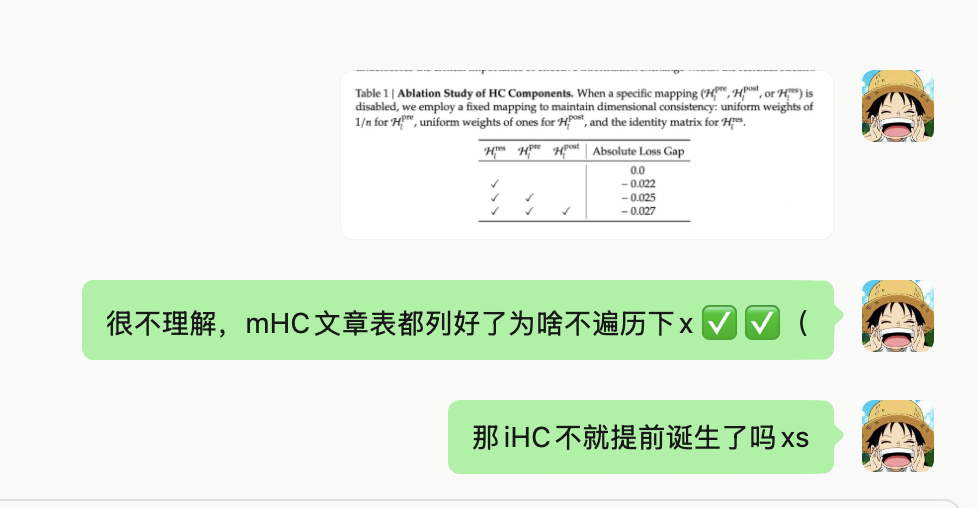
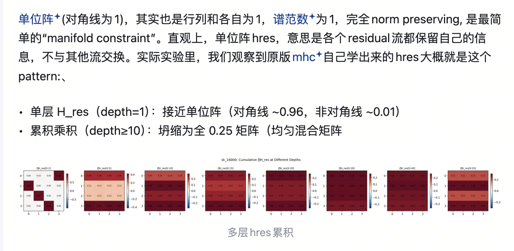
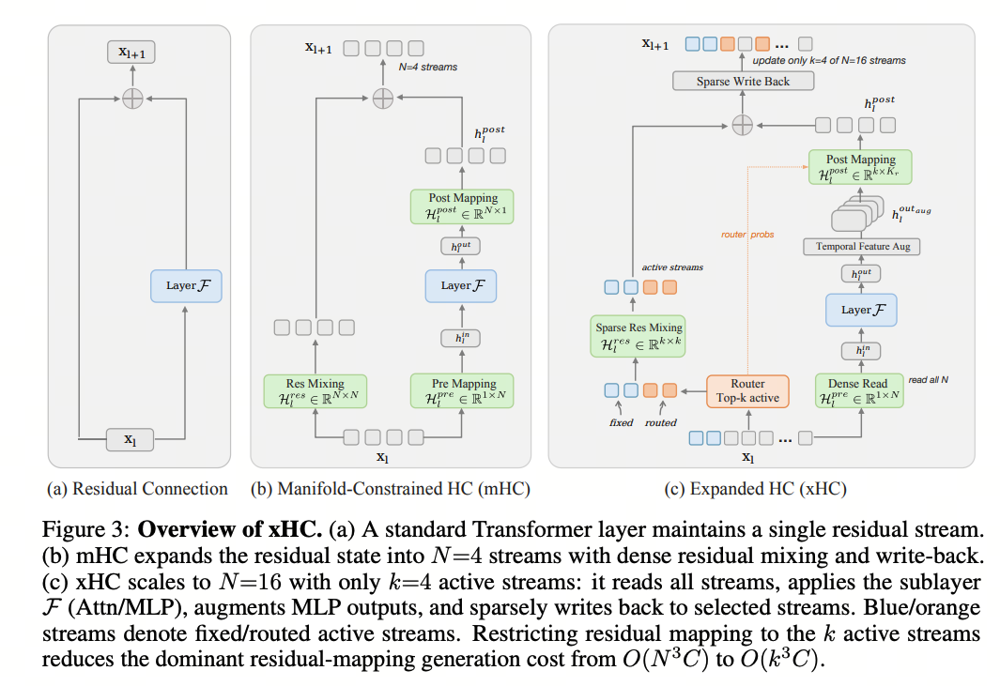

# Beyond Residual Connection

::: {#residual-overview}

| Type | Simplified Structure | Core Idea | Dynamics / Constraints | Representative Models |
| :--- | :--- | :--- | :--- | :--- |
| **PreNorm** | $x'=x+F(\mathrm{Norm}(x))$ | One residual stream; a fixed identity shortcut accumulates layer outputs | Fixed identity; no learned residual mixing | Most models other than those listed below |
| **HC** | $\begin{aligned}R'&=H_{\mathrm{res}}\cdot R\\&\quad+H_{\mathrm{post}}\cdot F(H_{\mathrm{pre}}\cdot R)\end{aligned}$ | Expands one residual stream into several; learns Read, Write, and residual mixing | $H_{\mathrm{res}}$ is learned and data-dependent; flexible, but deep training can be unstable | HC |
| **mHC** | $H'_{\mathrm{res}}=\operatorname{Sinkhorn\text{-}Knopp}(H_{\mathrm{res}})$ | Constrains HC residual mixing to keep multiple residual streams stable in deep networks | **Doubly stochastic matrices address HC's instability at depth** | DeepSeek-V4-Pro, DeepSeek-V4.1-Flash |
| **iHC** | $H_{\mathrm{res}}=I$ | **Replaces mHC's doubly stochastic matrix with the identity**, retaining Read / Write across multiple residual streams | $H_{\mathrm{res}}=I$; fixed identity residual mixing | HY4-Preview |
| **GR** | $H_{\mathrm{res}}=I$ + channel-level Read | **Channel-level Read**; gates dynamically control what a sublayer reads from the residual stream | $H_{\mathrm{res}}=I$; **element-wise, data-dependent read gates** | Qwen3.8-Flash-Next |
| **AttnRes** | $h_l=\sum_i\alpha_{i\to l}\cdot v_i$, $\alpha=\mathrm{softmax}(q_l\cdot k_i)$ | Replaces fixed residual accumulation with attention over earlier layers / blocks, selecting information for the current layer | Softmax weighting along depth; K3 uses Block AttnRes to reduce overhead | Kimi K3 |

:::

Residual connections deserve to be called the milestone that put the “deep” in deep learning. In recent years, after tinkering with just about every part of the Transformer, people have finally sharpened their knives for the residual connections too.

## 1. Starting with Pre-Norm and Post-Norm

It all starts with the Pre-Norm versus Post-Norm debate. Put simply:

**Pre-Norm**: normalize before each residual branch. Apply Norm first, then pass the result to a sublayer such as Attention or an FFN.

**Post-Norm**: normalize after the residual connection. Compute the sublayer output, add the residual, and then apply Norm.

Most large language models today use **Pre-Norm**. One major reason is that it gives the residual backbone a more direct path for gradient propagation, making deep Transformers more stable to train. It helps mitigate vanishing or exploding gradients, making it easier to scale to dozens or even hundreds of layers.

Pre-Norm has limitations, though. Its residual update can be written approximately as:

$$
x_{l+1}=x_l+F\!\left(\mathrm{Norm}(x_l)\right).
$$

As the network gets deeper, its representation keeps accumulating residual information from earlier layers. The increment introduced by any later layer may become progressively smaller relative to the accumulated backbone representation, so the change between adjacent deep layers gradually weakens.

In other words, adding more physical layers does not guarantee that each new layer contributes an equally meaningful transformation. The network's effective depth may be lower than its nominal depth.

As kexue.fm put it, **Pre-Norm, in a sense, “increases the model's width while reducing its depth.”**

Pre-Norm and Post-Norm therefore embody a trade-off:

**Pre-Norm is easier to optimize and more stable to train, but may sacrifice some of the representational power that depth provides; Post-Norm can, in principle, preserve stronger transformations from layer to layer, but makes deep networks harder to optimize.**

A whole line of papers has tried to resolve this. To me, one of the best directions is Hyper-Connections.

## 2. HC

HC works roughly like this: **first replicate the original hidden state into $n$ parallel hidden streams. At each layer, use $A_m$ to mix these $n$ streams into one weighted input for a normal Attention or FFN sublayer, computed only once. Then use $B$ to write the new layer output back to the $n$ streams with different weights, while $A_r$ preserves and mixes the existing streams along the residual path. The resulting $n$ hidden states continue to the next layer. In effect, a fixed residual connection becomes a learned routing mechanism across multiple streams.**

Put plainly: maintain $n$ streams, then decide which ones this layer reads from, which ones it writes its output to, and how the old information moves forward.

Section 4.5 of the paper also has some excellent visualizations and analysis. Maybe HC started the trend: its successors keep doing similar visualizations, which is a great habit! I strongly recommend reading the original paper.

Here are a few takeaways:

- The unrolled effective connection matrix shows that HC learns both:

    - **Strong local connections**: greater dependence on recent layers, similar to Post-Norm.

    - **A few direct long-range connections**: retention of important early-layer information, similar to Pre-Norm.

- Together, these give us **short-range updates for most information, with long-term retention of a few important pieces**.

- Connections between some adjacent layers are close to zero. This suggests that the model spontaneously forms something like **Parallel Transformer Blocks, where Attention and the FFN run in parallel; see the zigzag pattern in the figure.**

- Attention outputs tend to be used locally, while FFN outputs more readily form long-range connections.

- With $n=1$, it is hard to achieve both “local updates” and “long-term retention.” With $n>1$, different streams can take on these two roles.

## 3. mHC

Unroll a multilayer HC network, and a signal from an early layer has to pass through:

$$
\prod_{i=1}^{L-l}\mathcal{H}_{L-i}^{\mathrm{res}}
$$

to reach layer $L$. The full expression is:

$$
\mathbf{x}_L=
\left(
\prod_{i=1}^{L-l}\mathcal{H}_{L-i}^{\mathrm{res}}
\right)\mathbf{x}_l
+
\sum_{i=l}^{L-1}
\left(
\prod_{j=1}^{L-1-i}\mathcal{H}_{L-j}^{\mathrm{res}}
\right)
\mathcal{H}_i^{\mathrm{post}\top}
\mathcal{F}
\left(
\mathcal{H}_i^{\mathrm{pre}}\mathbf{x}_i,\mathcal{W}_i
\right).
$$

In a traditional ResNet, the corresponding first term is simply $I\mathbf{x}_l$. HC replaces it with a long product of unconstrained matrices. If those matrices have directions that amplify by more than 1 or contract by less than 1, then after dozens of layers:

$$
\left\|
\prod_l \mathcal{H}_l^{\mathrm{res}}
\right\|
$$

can blow up through repeated multiplication.

mHC addresses this using doubly stochastic matrices, meaning:

1. Every entry is nonnegative: $H_{ij}\ge 0$.

2. Every row sums to $1$.

3. Every column sums to $1$.

Doubly stochastic matrices have several particularly nice properties, including those highlighted in the paper:

1. Norm Preservation: their spectral norm is bounded by 1, which helps mitigate exploding gradients.

2. Compositional Closure: these nice properties are preserved under matrix multiplication! Even after composition across many layers, the overall residual mapping remains doubly stochastic.

3. Geometric Interpretation via the Birkhoff Polytope: I'll leave this one to the original paper =.=.

The core of mHC is to turn HC's most unstable component, the residual-stream mixing matrix $H_l^{\mathrm{res}}$, from an arbitrary learned matrix into a **doubly stochastic matrix**. The input first dynamically generates $\tilde{H}_l^{\mathrm{res}}$; Sinkhorn-Knopp then repeatedly normalizes its rows and columns so that $H_l^{\mathrm{res}}\ge 0$ and each row and column sums to approximately 1. Meanwhile, $H_l^{\mathrm{pre}}=\sigma(\tilde{H}_l^{\mathrm{pre}})$ and $H_l^{\mathrm{post}}=2\sigma(\tilde{H}_l^{\mathrm{post}})$ keep the read and write coefficients positive. The $n$ residual streams can still exchange information dynamically, while the bound $\|H\|_2\le 1$ and closure under multiplication keep $\prod_l H_l^{\mathrm{res}}$ from developing extreme gain across many layers. With $n=4$ and 20 Sinkhorn iterations, the paper reports that composite gain in the 27B model falls from nearly 3000 for HC to about 1.6 for mHC.

**On the infra side,** the real bottleneck in HC/mHC is memory access, activation storage, and pipeline communication after expanding the residual state to $nC$, rather than FLOPs. The authors therefore combine three kinds of optimization:

First, **kernel fusion + mixed precision** for RMSNorm, dynamic generation of $H^{\mathrm{pre/post/res}}$, Sinkhorn, and residual merging. In particular, fusing the application of $H^{\mathrm{post}}$ and $H^{\mathrm{res}}$ with the residual merge reduces reads in this part from $(3n+1)C$ to $(n+1)C$, and writes from $3nC$ to $nC$.

Second, **selective recomputation**: instead of retaining every intermediate mHC activation, save $x_{l_0}$ at block boundaries and recompute only the inexpensive mHC operations during the backward pass. The paper derives an approximately optimal recomputation interval of $L_r^*\approx\sqrt{nL/(n+2)}$.

Third, overlap communication and computation in DualPipe, placing some residual kernels on high-priority streams to reduce pipeline stalls from the $n$-fold residual communication. The authors ultimately report about 6.7% additional training time for large models with $n=4$.

But mHC only guards against explosion; it does not guarantee that information will not be lost or even collapse.

\clearpage

\begingroup
\linespread{1.0}\selectfont

## 4. iHC

Let's take a closer look at iHC.

Honestly, iHC feels very natural to me. When I first saw HC, this was my immediate reaction: if multiplying these matrices can cause an explosion, why not just use the identity matrix and let each stream go its own way?

{width=48%}

The chat in the screenshot says: “I don't get it: mHC already lays out the table, so why not sweep through the combinations?” and “Wouldn't iHC have emerged earlier that way? lol.”

iHC author Tian Xie makes a particularly interesting observation here:

\noindent\hfill
{width=68%}
\hfill\mbox{}

The screenshot describes identity as the simplest manifold constraint: rows and columns sum to 1, the spectral norm is 1, and norms are fully preserved. Each residual stream retains its own information without exchanging it with others. In the original mHC experiments, a single-layer residual mapping is near identity (diagonal about 0.96, off-diagonal about 0.01), but products across 10 or more layers collapse toward an all-0.25 averaging matrix. The bottom label reads “cumulative residual mappings across layers.”

The identity matrix is itself doubly stochastic, so it inherits the benefits discussed under mHC. With hindsight, it may have a few additional advantages:

1. Numerical stability!

2. Each stream keeps its identity. The residual path can focus on preserving its own information, leaving reads, writes, and communication across streams to $H^{\mathrm{pre}}$ and $H^{\mathrm{post}}$.

3. $H^{\mathrm{pre}}$ and $H^{\mathrm{post}}$ no longer have to adapt to the reshuffling or mixing introduced by $H^{\mathrm{res}}$.

4. No more SK, so infra finally gets a break from Sinkhorn-Knopp! Funny timing: as I write this, I'm watching the baffling ban/pick decisions of SK, the Wolves' coach in the KPL esports league...

\clearpage

\endgroup

## 5. Gated Residual

Qwen3.8 Flash Next is my favorite paper of the year so far. Every design choice deserves a close read.

The authors first expand the residual stream from $1$ to $n$, but deliberately keep reading and writing simple: a static weighted sum for reads, and writing to one branch at a time in rotation. This tests how much “just widening the residual stream” can achieve. Widening alone improves loss by 0.01, consistent with the earlier conclusion that wider residual streams are central to HC.

The ablations reveal the following:

1. **Simply widening the residual stream is already effective.**

2. **Data-dependent reads and writes still matter.**
   The improvement is especially clear on downstream benchmarks, more so than the loss alone suggests.

3. **Sigmoid works better than tanh for gating**, consistent with mHC's findings.

4. **Read granularity matters more than Write granularity.**
   Reads benefit from per-branch, per-channel control; a scalar per branch is enough for writes.

5. **Read/write operators should be predicted using information from all branches.**
   This works better than looking at only one branch or pooling first.

6. **Separate RMSNorm for each branch works better.**

7. **iHC gets it right: when reads and writes are strong enough, branch mixing through $H^{\mathrm{res}}$ adds little.**

GR Read therefore goes like this: independent RMSNorm for each branch → concatenate all branches → low-rank MLP → sigmoid gates for each branch and channel → average the gated branches to obtain the block input.

## 6. Attention Residuals

An excellent paper. A vivid way to describe it is to rotate attention by ninety degrees and apply it to the residual connections.

### Full AttnRes: Aggregating Earlier Representations Across Depth

In a standard Pre-Norm Transformer, the input to layer $l$ can be expanded as:

$$
h_l=h_1+\sum_{i=1}^{l-1}f_i(h_i).
$$

The embedding and all earlier sublayer outputs are accumulated into the residual stream with a fixed weight of $1$. AttnRes rewrites this as:

$$
h_l=\sum_{i=0}^{l-1}\alpha_{i\rightarrow l}v_i,
\qquad v_0=h_1,\quad v_i=f_i(h_i)\ (i\ge 1).
$$

The weights $\alpha_{i\rightarrow l}$ are now learned dynamically through softmax. Each target layer $l$ introduces a learned $d$-dimensional pseudo-query $w_l$, with earlier layer outputs serving as keys and values. Apply RMSNorm to the keys, then compute:

$$
s_{i,l}=w_l^\top\mathrm{RMSNorm}(v_i),
\qquad
\alpha_{i\rightarrow l}=\mathrm{softmax}_i(s_{i,l}).
$$

These weights are then used to aggregate earlier representations. Although $w_l$ itself does not depend on the token, $v_i$ is input-dependent, so each token still gets different routing across layers. The authors initialize $w_l$ to $0$, giving every earlier layer equal weight at the start of training, before the model gradually learns selective connections.

Full AttnRes lets every layer attend directly to all preceding layers, offering the finest-grained selection. But the memory and communication demands are enormous; using it in an actual production model is not realistic.

### Block AttnRes: Aggregating at the Block Level

Large models therefore mainly use Block AttnRes: group $S$ consecutive sublayers into a block, and retain ordinary residual accumulation within that block:

$$
b_n=\sum_{j\in B_n}f_j(h_j).
$$

A new layer applies depth-wise attention only to completed historical block representations $b_0,\ldots,b_{n-1}$, with the partial sum of the current block's already-computed sublayers included as another candidate value.

This compresses “retrieval by layer” into “retrieval by block.” A 128-layer model, for instance, might maintain roughly 8 block sources instead of 128 historical sources. Storage and communication costs fall substantially, while preserving the key ability to actively look back at information from distant depths.

On the infra side, the simple version—as for the deeper implementation details, I don't fully understand them either!—is that Kimi mainly uses three ideas: block grouping reduces the historical states that need to be stored and accessed; input-independent queries allow inter-block attention for a block to be precomputed in batches; and caching historical block states trades memory for fewer repeated transfers in the pipeline.

## 7. xHC

This paper studies a problem left by HC/mHC: expanding the Transformer's single residual stream into $N$ parallel streams has mostly stopped at $N=4$. The authors identify two main barriers to increasing $N$. The first is an **information bottleneck**: each layer has only one output to write back to $N$ streams, so larger $N$ makes it easy for the streams to learn redundant histories. The second is a **cost bottleneck**: mHC dynamically generates an $N\times N$ residual mixing matrix from an $NC$-dimensional state, giving the corresponding projection a complexity of $O(N^3C)$.

xHC tackles both. On the information side, it applies three causal depthwise 1D convolutions after the MLP output, with kernel sizes 4/8/12. The current output and local context at different time scales form four write-back components, with Gram-Schmidt reducing their collinearity. On the computation side, it uses **dense read + sparse write**: there are $N=16$ residual streams, but each layer activates only $k=4$ for residual mixing and write-back. Two are always active; a router dynamically selects the other two. The layer input still reads densely from all 16 streams. This retains the persistent state / memory of 16 streams while reducing the most expensive residual-mapping component from $O(N^3C)$ to $O(k^3C)$.

## 8. VWN

VWN is a paper I keep thinking of as an overlooked gem. It is a really, really, really good paper, yet it has only two citations as I write this. It starts from a different motivation:

**Increasing a Transformer's hidden width often improves its representational capacity, but Attention/FFN computation and parameter counts grow roughly quadratically with width. MoE can expand FFN capacity cheaply, yet it leaves the representational bottleneck of the backbone hidden dimension unresolved.** How can we make the model wider without increasing computation too much?

VWN decouples “representation width” from “actual computation width.” Tokens and hidden states carried across layers maintain an $rD$-dimensional **over-width representation**. Before each Attention/FFN computation, Generalized Hyper-Connections (GHC) dynamically compress this to $D$ dimensions; after computation, the output is written back to the wide state. The expensive Transformer backbone therefore remains $D$-wide.

GHC also divides the wide state into multiple slots, using learned $A$/$B$ routing matrices to carry, mix, and update information across layers. At the output, it reduces the state back to $D$ dimensions.

The paper further combines VWN with Multi-Token Prediction (MTP), aiming to use denser prediction supervision to make full use of the additional representational freedom.
