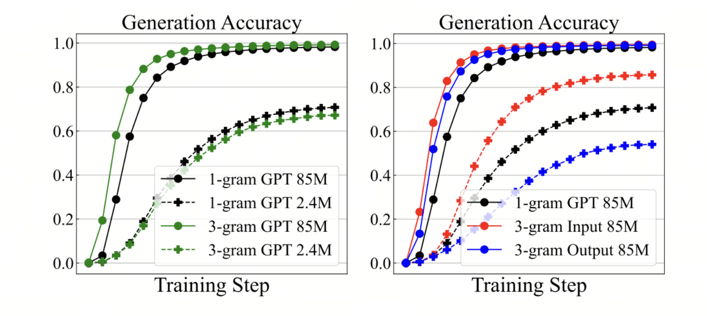
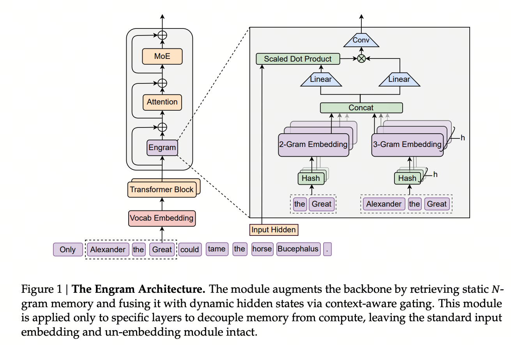
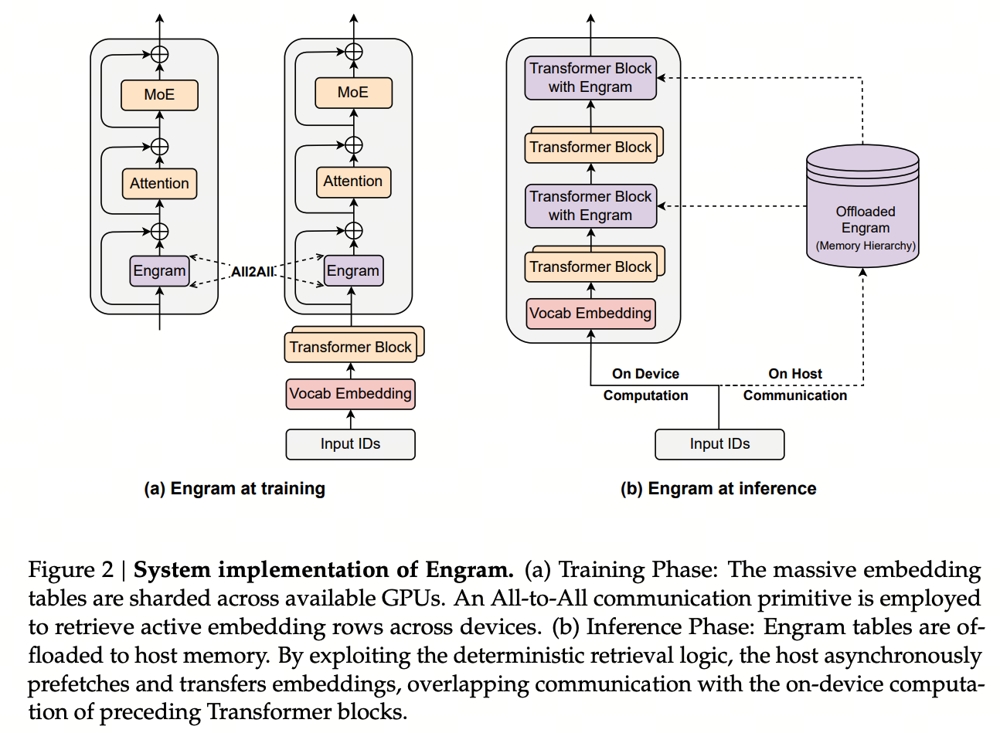
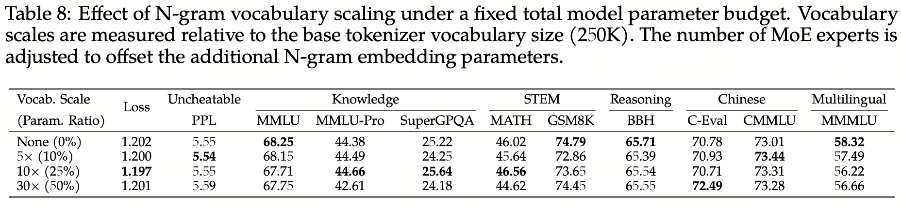
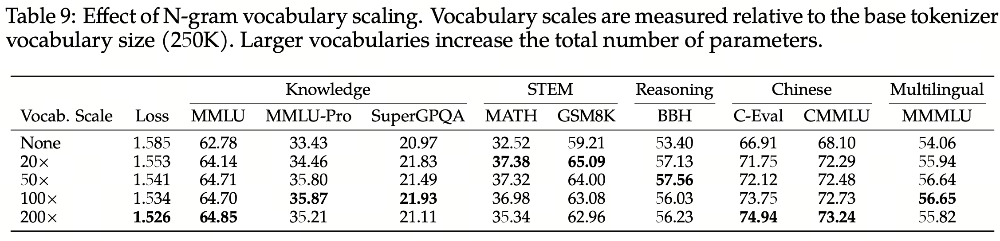

# Should Vocab Embeddings Be Sparse Too?

::: {#embedding-overview}

| **Model** | **Core Method** | **N-gram** | **Address Mapping** | **Injection Location** | **Context-aware Gate** | **Parameters** |
| :---: | :---: | :---: | :---: | :---: | :---: | :---: |
| **Over-Tokenized Transformer (OE)** | **Hierarchical N-gram → Feature Hashing → sliced low-dim embeddings → projection → input embedding** | 1…N-gram | f(ngram) mod m + multiple sliced tables | Model input | - | - |
| **Gemma 4 E2B/E4B** | **Per-Layer Embedding: independent token embedding at each layer + context projection** | - | Token-ID lookup | Every layer | - | - |
| **Engram-27B** | **Tokenizer compression → N-gram → multi-head Hash → memory lookup → context-aware fusion → short causal Conv → multiple residual streams** | 2/3-gram | compressed IDs + 8 hash heads/order | Layers 2, 15 | ✓ | 5.7B, 21.30% |
| **LongCat-2.0** | **Scale OE** | 2–5 gram | Hash/mod + 4 splits/order | Model input | - | 135B, 8.4% |
| **DeepSeek-V4.1-Flash** | **Scale Engram; remove short Conv; Sinkhorn balancing** | 2/3/4-gram | compressed IDs + 8 hash heads/order | Layers 2, 15 | ✓ | 196B, 26.2% |
| **Qwen3.8-Flash-Next** | **Scale Engram; remove tokenizer compression and hash raw token IDs directly** | 2/3-gram | raw token IDs + 8 hash heads/order | Layer 2 | ✓ | 51B, 29.0% |

:::

## 1. Over Encoding

### Input Vocabulary and Output Vocabulary

Earlier papers have observed that a large tokenizer vocabulary often helps large models but can hurt small ones.

However, a tokenizer, or its vocabulary, actually serves two roles: **input vocabulary** and **output vocabulary**.

We can therefore disentangle the question: is it the larger input vocabulary or the larger output vocabulary that hurts small models?

{width=90%}

Over Encoding (OE) finds that the culprit is actually **a large output vocabulary**.

There is an intuitive explanation. Enlarging the input vocabulary strengthens **the mapping from context to representations**. Enlarging the output vocabulary, however, turns prediction into a finer-grained and more difficult classification problem. Large models can make use of this supervision, while small models are more likely to underfit.

From this perspective, **input vocabulary and output vocabulary should not be tied together when scaling**.

### Hierarchical N-grams and Feature Hashing

The paper keeps the original BPE token sequence unchanged. Instead of looking up only the current token at each input position, it **looks up both the current token and n-grams ending at that position**.

For example, if the current token is $c$ and the previous two tokens are $a,b$, it constructs:

- **1-gram**: $c$;
- **2-gram**: $(b,c)$;
- **3-gram**: $(a,b,c)$.

Each fixed-length n-gram is first uniquely encoded as a large integer using:

$$
f(z_1,\ldots,z_n)=\sum_{j=1}^{n}z_j V^{j-1},
$$

where $V$ is the base vocabulary size. There are theoretically $V^n$ combinations, so building an embedding table with $V^n$ rows is impractical. The authors use **feature hashing** instead: compute $f(\cdot)\bmod m$ and look up a table with only $m$ rows, $E[f(\cdot)\bmod m]$. Different n-grams are allowed to collide in the same row.

**Hierarchical n-grams** means using embeddings for orders $1+2+\cdots+n$ at the same position, rather than only a 3-gram. For example:

$$
h_c=E_1[c]+E_2\!\left[f(b,c)\bmod m\right]
+E_3\!\left[f(a,b,c)\bmod m\right].
$$

This preserves information about individual tokens, short local combinations, and longer local combinations at the same time.

### Sliced Low-Dimensional Embeddings

For each n-gram order, the authors go further than building a single wide $m\times d$ table. They use **sliced low-dimensional embeddings**, splitting the same parameter budget across $k$ narrower tables of size $m_i\times(d/k)$. Each lookup returns a low-dimensional vector, which is projected back to the model dimension using $W_i\in\mathbb{R}^{(d/k)\times d_{\mathrm{model}}}$, and then summed:

$$
E_{\mathrm{slice}}(x)=\sum_{i=1}^{k}E_i[x\bmod m_i]W_i.
$$

The key detail is that the table sizes $m_i$ are deliberately slightly different, such as $m,m+2,m+4$. The same n-gram therefore receives several different hash addresses: $x\bmod m$, $x\bmod(m+2),\ldots$. Even if it collides with another n-gram in one table, it is unlikely to collide in every table.

The result is **BPE embeddings + hierarchical n-grams × low-dimensional embeddings from multiple distinct hash views**, all summed before entering an otherwise unchanged Transformer. This adds many sparsely accessed lookup parameters with almost no additional Transformer backbone FLOPs.

The procedure also shows that **OE's hash addresses and sparse lookups depend only on token IDs**. They do not need to wait for contextual hidden states, making them well suited to CPU execution or advance computation. The Linear projections after lookup still involve matrix operations, but even with a very large OE parameter count, each token accesses only a few rows. Viewed this way, it is also a form of input embedding sparsification.

```text
2-gram (b,c)   -> hash_i -> Emb_i -> Linear_i -> sum_i --+
3-gram (a,b,c) -> hash_i -> Emb_i -> Linear_i -> sum_i --+-> SUM
1-gram c      -> Token Embedding ------------------------+     |
                                                              v
                                                    Transformer -> LM Head
```

Within each n-gram branch, $i=1,\ldots,k$ indexes the slices. Their outputs are summed within the branch, then added to the base token embedding.

\clearpage

## 2. Per-Layer Embeddings (PLE)

Gemma 3n and Gemma 4 E2B / E4B all use **Per-Layer Embeddings**.

The motivation is to **reduce the backbone's burden of storing static memories, using memory scaling in place of compute scaling**, while allowing different depths to learn different token priors. Reducing the burden of static memory is also a motivation behind the later Engram work.

In addition to the ordinary token embedding, each token receives an independent low-dimensional embedding for every layer. For example:

$$
\text{token}\times\text{layer}\;\longrightarrow\;\text{256-d vector}.
$$

At layer $m$, the model retrieves the token's PLE for that layer. The current contextual hidden state is multiplied by a gate matrix and passed through GELU to produce a gate that selectively reads the stored information. The result is projected back to the hidden dimension and added to the residual stream.

This can be understood as **layer-specific token memory**. Deep layers do not have to rely entirely on the preceding dozens of layers to preserve the original token information. Each layer can directly access static memory learned specifically for that depth.

This increases model capacity through a large number of sparsely accessed embedding parameters, while adding relatively little actual computation.

## 3. Engram

### Motivation: Conditional Memory

Engram is a rare paper that is excellent both technically and in its writing. It builds on the design experience of OE and PLE and introduces further innovations. Let's take a closer look.

Its motivation begins by separating model computation into two categories:

1. **Dynamic, compositional computation**: logical reasoning, mathematical derivations, code, and long-range relationships, which require actual computation through deep blocks.

2. **Static, local, repeated patterns**: names, places, fixed phrases, idioms, and common local combinations. These are closer to "see a key, retrieve a value" and do not require deep computation to obtain this kind of factual knowledge.

**The authors have an even larger ambition: to establish a second axis of sparsity, Conditional Memory, and a third way to scale LLM capacity alongside dense compute and MoE experts: adding static, sparsely accessed memory.**

### From N-gram Lookup to Residual Injection

{width=90%}

Many tokens in an LLM tokenizer have **nearly equivalent textual forms but completely different IDs**, owing to differences such as capitalization or leading spaces. Engram first applies **canonicalization**, mapping these variants into a more unified representation space.

At each position, it then constructs local phrases such as 2-grams and 3-grams and uses multiple independent hash functions to retrieve entries from very large embedding tables:

$$
e_t=\operatorname{Concat}\!\left(
\left\{E_{n,k}[\phi_{n,k}(g_{t,n})]\right\}_{n,k}
\right).
$$

The retrieved memory $e_t$ passes through a shared Value projection $W_V$:

$$
v_t=W_Ve_t.
$$

In mHC, the residual streams within a layer share this memory and $W_V$, while each branch $m$ has its own $W_K^{(m)}$. The model computes a **context-aware gate** from the current branch's hidden state $h_t^{(m)}$ and the memory key:

$$
\alpha_t^{(m)}=\sigma\!\left(
\frac{
\operatorname{RMSNorm}(h_t^{(m)})^{\top}
\operatorname{RMSNorm}(W_K^{(m)}e_t)
}{\sqrt{d}}
\right).
$$

The memory actually read by that branch is then:

$$
\tilde v_t^{(m)}=\alpha_t^{(m)}v_t.
$$

Finally, the paper adds a lightweight **short depthwise causal convolution** over the gated memory sequence $\tilde V$, with the stated goal of expanding the local receptive field and increasing nonlinearity:

$$
Y=\operatorname{SiLU}\!\left(
\operatorname{Conv1D}\!\left(\operatorname{RMSNorm}(\tilde V)\right)
\right)+\tilde V.
$$

(I am quite skeptical about this component.)

The result $Y$ is written back to the corresponding residual stream. The full procedure is **canonicalization → N-gram hash lookup → context-aware gated retrieval → local causal convolution refinement → residual injection**.

### Infrastructure: Host Memory and Prefetch

As with OE, hash addresses depend only on token IDs. Memory can therefore be looked up in CPU / host DRAM in advance and transferred asynchronously to the GPU, overlapping with earlier-layer computation. Parameter capacity can grow substantially while the number of lookups per token stays fixed; projections, gating, and convolution still incur a small computational cost.



\clearpage

### Interesting Experimental Questions and Findings

The results speak for themselves. Let's look at some of the more interesting experimental questions and conclusions in the paper.

1. **How should a fixed parameter budget be split between MoE and Engram?**

    The experiments hold total and active parameter counts fixed, changing only how the sparse budget is allocated between MoE and Engram. The result is clearly U-shaped: pure MoE is not optimal. Allocating roughly **75%-80% to MoE and 20%-25% to Engram** works best.

2. **Can Engram scale?**

    Yes. With the backbone fixed, progressively enlarging the Engram table keeps reducing validation loss, with a relatively stable scaling trend. Even better, the memory table can become very large while each token still accesses a fixed number of rows, so parameter growth does not produce a proportional increase in FLOPs. Memory size can therefore become a new scaling axis independent of model computation.

3. **Can N-gram memory improve reasoning?**

    Yes! Engram itself is not "doing reasoning," but it may spare early layers from reconstructing static entities and phrases, allowing higher-level semantic processing to begin earlier. LogitLens and CKA show that shallower layers in an Engram model can form representations resembling those of deeper baseline layers. The authors describe this as improved **effective depth**: more of the Transformer's actual depth is available for compositional reasoning, mathematics, and code.

4. **Can Engram improve long-context performance?**

    Yes! Ordinary Attention handles not only long-range dependencies but also considerable local pattern modeling. Engram assigns some local dependencies directly to memory lookup, leaving more Attention capacity for global dependencies. (Writing this reminds me once again of Zeyuan's Physics of Language Models.)

5. **Where should Engram be placed, and which components actually matter?**

    There is a trade-off. Too early, the hidden state lacks context and the gate may be inaccurate; too late, earlier-layer computation has already been spent. The paper finds that placing Engram at the second layer works best, and splitting the budget across multiple Engram modules at different depths can improve results further.

    In the ablations, **context-aware gating, tokenizer compression, and mHC branch-specific fusion** matter most. Short Causal Conv brings only a small improvement (so DS4.1 simply removes it).

6. **What does Engram actually learn?**

    Disabling Engram causes a large decline on factual knowledge tasks, while reading comprehension is better preserved. This suggests a natural division of labor: Engram focuses more on static parametric knowledge, such as entities, facts, and fixed phrases, while the Transformer backbone focuses more on contextual processing, composition, and reasoning.

Of course, these conclusions come from experiments on small models. The specific Engram configurations in released models have already evolved.

\clearpage

## 4. Ablations in Qwen3.8 Flash Next

Here, I will briefly discuss the ablation findings from Qwen3.8 Flash Next.



1. **N-gram layer placement.** Shallow layers are generally stronger, although middle and deep layers remain competitive. Splitting a fixed parameter budget across two layers does not provide consistent gains. The final choice is therefore **Layer 2 only**. This allows N-gram embeddings to be prefetched from host memory while Layer 1 is being computed.

2. **Fixed total parameter budget.** Allocating about 25% of the parameters to N-grams gives the best training loss, but downstream evaluations do not show a corresponding optimum at 25%.

3. **Fixed backbone with additional N-gram parameters.** N-grams continue to scale in terms of loss. However, **lower loss does not necessarily mean better downstream performance**: reasoning benchmarks plateau or even decline beyond a certain memory size.

4. **Chinese benchmarks.** N-gram scaling is particularly consistent on Chinese benchmarks such as C-Eval and CMMLU.



LongCat-2.0 makes somewhat different choices as well. I will not go into them here; interested readers can consult its technical report.
