# World Action Model：从视频生成先验到机器人动作

### UniPi

*Learning Universal Policies via Text\-Guided Video Generation* 

将控制严格分成视觉规划与动作解码两步。

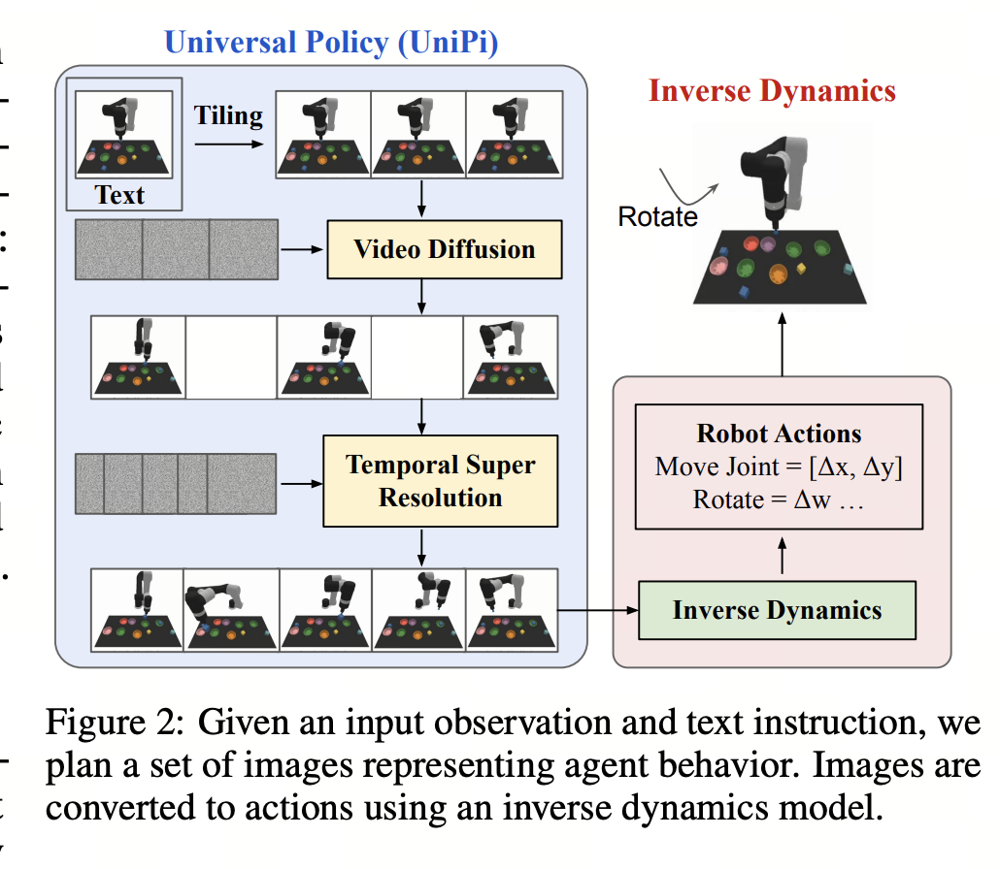

$(o_t,l)
\rightarrow
\text{text-guided video diffusion}
\rightarrow
\hat{o}_{t+1:t+K}
\rightarrow
\text{inverse dynamics}
\rightarrow
a_{t:t+H}.$

训练视频规划器时可以使用模拟轨迹、真实机器人视频和 YouTube 等无动作视频，因为视频损失只要求观测序列；真正的机器人动作 grounding 则由带动作数据训练的 IDM 完成。推理时必须先生成未来 RGB 计划，视频不是辅助损失，而是动作产生所需的中间变量。优点是计划可视化且规划器不绑定单一本体；限制是视频生成会有错误、时间对齐误差和 IDM 误差会串联传播，完整视频去噪也带来显著开销。

### PAD

*Prediction with Action: Visual Policy Learning via Joint Denoising Process* 

不再采用“先视频、后 IDM”的串联方式，而是在同一个 DiT 中同时去噪未来图像和动作：

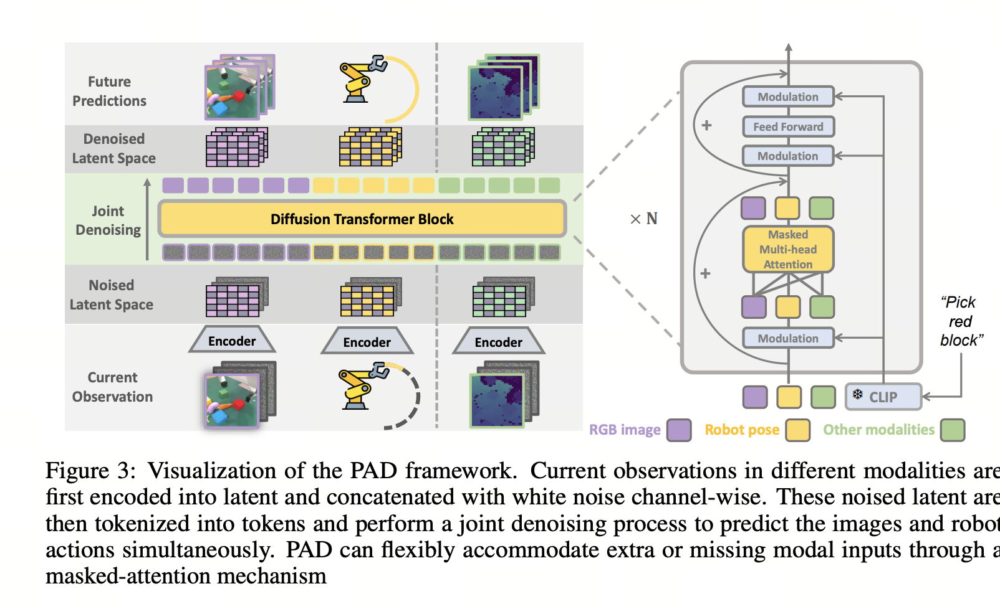

$(o_t,s_t,l,\epsilon_{\text{video}},\epsilon_a)
\rightarrow
\text{joint DiT denoising}
\rightarrow
(\hat{o}_{t+1:t+K},\hat{a}_{t:t+H}).$

带动作机器人轨迹同时监督两种输出；无动作视频可以把动作 token 替换为 mask，只更新视觉预测部分，并通过共享 transformer 间接影响动作表示。推理时模型仍执行联合未来预测和动作生成，动作和视频共享backbone。

### UWM 

*Unified World Models* 

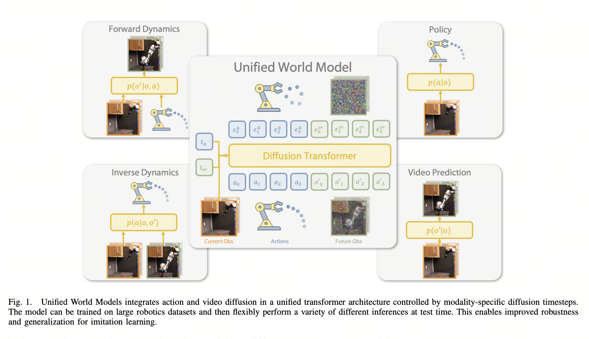

把视频和动作放进同一扩散过程，并且为二者使用独立 diffusion timestep。统一模型学习联合分布 p\(o,a,o'\)，通过调节两个模态的噪声级别，分别查询：


$p(a\mid o),\quad
p(o'\mid o,a),\quad
p(a\mid o,o'),\quad
p(o'\mid o).$

策略推理时，未来图像的扩散时间固定在最大噪声 $T$，相当于将其边缘化，只对动作去噪。无动作视频则反过来把动作保持在最大噪声，只训练action，推理时候也不需要推理video。论文实验中的 action\-free 数据主要来自忽略动作标签的机器人视频，而不是大规模普通互联网视频。

### UVA

*Unified Video Action Model*


mask魅力时刻 again，masked training 让模型可充当 policy、video generator、forward dynamics 或 IDM。标准 policy 模式直接从共享 latent 调用 action head，不需要借助video gen。与UWM不同的是UWM是 在 diffusion 过程和主干参数上联合；UVA 在 shared latent representation 上联合，但在输出解码时分开使用两个mar head，这样action diffusion的时候会更快。

### VPP

*Video Prediction Policy* 

采用两阶段训练。第一阶段用互联网人类操作、互联网机器人操作和下游机器人视频，将 Stable Video Diffusion 微调为文本条件 Manipulation TVP；第二阶段冻结 TVP：

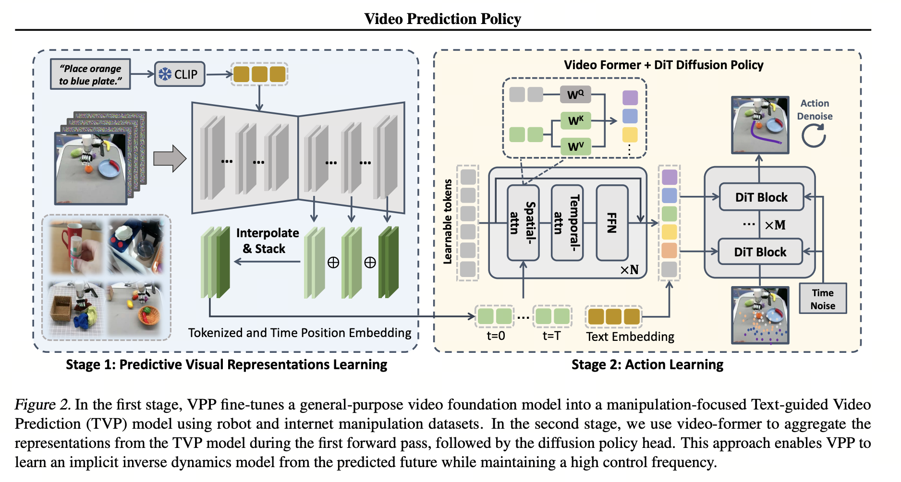

$(o_t,l,\epsilon_{\text{future}})
\rightarrow
\text{TVP 单次前向}
\rightarrow
h_{\text{predictive}}
\rightarrow
\text{Video-Former}
\rightarrow
\text{diffusion action head}.$

直接从第一次前向过程的中间层提取 predictive visual representation。动作 head 相当于一个隐式 IDM。

***从这里开始进入现代WAM***

### mimic\-video

*mimic\-video: Video\-Action Models for Generalizable Robot Control Beyond VLAs *

这篇文章我很喜欢

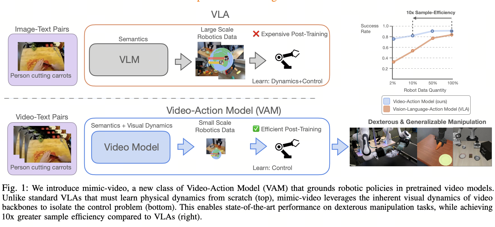

经典起手式之：VLA不行！


$(o_{\text{past}},l,\epsilon_{\text{future}})
\rightarrow
\text{部分视频 flow}
\rightarrow
h^{\tau_v}_{\text{video}}
\rightarrow
\text{action flow/IDM}
\rightarrow
a_{t:t+H}.$

- 视频骨干:预训练的视频扩散模型 Cosmos\-Predict2,在机器人视频上 LoRA 微调;

- 动作解码器:轻量 flow\-matching 解码器,当 IDM,条件于视频骨干的中间 latent 表征;

- 训练两阶段:① LoRA 微调视频骨干;② 冻结骨干、从零训动作解码器。

- 部分去噪：选择高噪声step去噪时候的中间层表征，类似VPP，原因可以看appendix D，很值得品下，简单记下我的理解：

    1. 缓解训推误差（有没有想到rae和diffusion forcing hhh）

    2. 高噪是正则 

    3. 高噪时候的模型是表征好的时候，低噪的时候只是refine

    4. Action policy 需要的不是像素质量最高的视频，而是对动作最有用的视频生成内部表征。

### DreamZero

*World Action Models are Zero\-shot Policies* 

dreamzero似乎是WAM的命名之作，现在WAM有这样的热度，有一部分原因也归功于Jim Fan的力推

我觉得dreamzero开场提到的wam优势是值得被深入探讨的：

1. 从多样化、非重复数据中高效学习，

2. 开放世界泛化，

3. 仅从视频数据中进行跨具身学习，

4. 对新机器人进行 few\-shot 适应

做法是使用自回归视频 DiT，在单一模型中联合流匹配视频 latent 与动作。

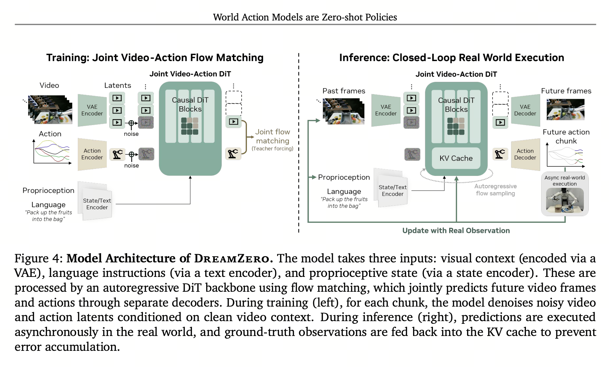

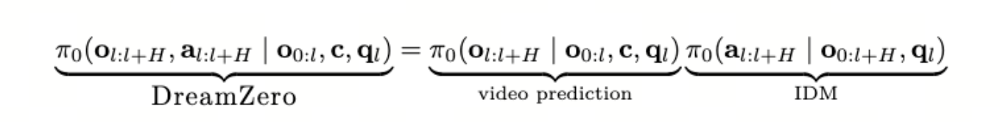

即视频预测与 IDM 的端到端组合，共享时间步，联合去噪。推理时，每个 chunk 生成未来视觉表示和对应动作；动作执行后，预测帧在 KV cache 中被真实观测替换，以限制长期误差积累（这个操作很典，后面lingbot\-va也会用）。DreamZero\-Flash 解耦了噪声调度，让动作完成去噪时，当前 chunk 的视频表示仍可处于较高噪声状态，从而加速。

此外就是一些结论：WAM体现了一定的OOD 泛化；多样性比重复性更重要；视频 backbone 存在明显规模效应；AR 与双向架构平均分相同但AR 动作更平滑、支持 KV cache、推理快 3–4 倍，并更容易保持语言—视频—动作时间对齐；视频\-only 跨 embodiment 数据有效；机器人通常忠实执行视频分支的计划，主要失败来自错误的视频规划，而不是动作提取失败；人类视频数据能提高未见任务表现。

当然，dreamzero由于是发版模型tech report，一些情况下消融可能很难以做的非常非常完美无缺。

### Fast\-WAM

*Fast\-WAM Do World Action Models Need Test\-time Future Imagination?*

Fast\-WAM它专门检验“训练时视频预测”与“推理时未来想象”是否必须绑定，有用的是训练表征，还是将推理时候的视频。训练时，未来视频 latent 和动作都接受 flow\-matching 损失，但注意力掩码禁止 action token 看到 future video token，并且在推理时直接出action。我觉得这是一篇很棒的学术论文，尽管他研究的思想可能在于之前的论文里面就有提及，但我觉得具身智能缺少很多篇这种类型的论文，去具体探讨一个现象究竟是否存在和到底是怎么样的机理。

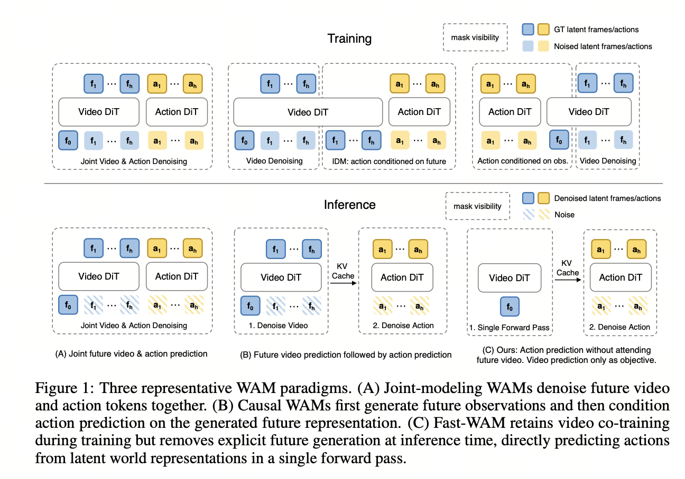

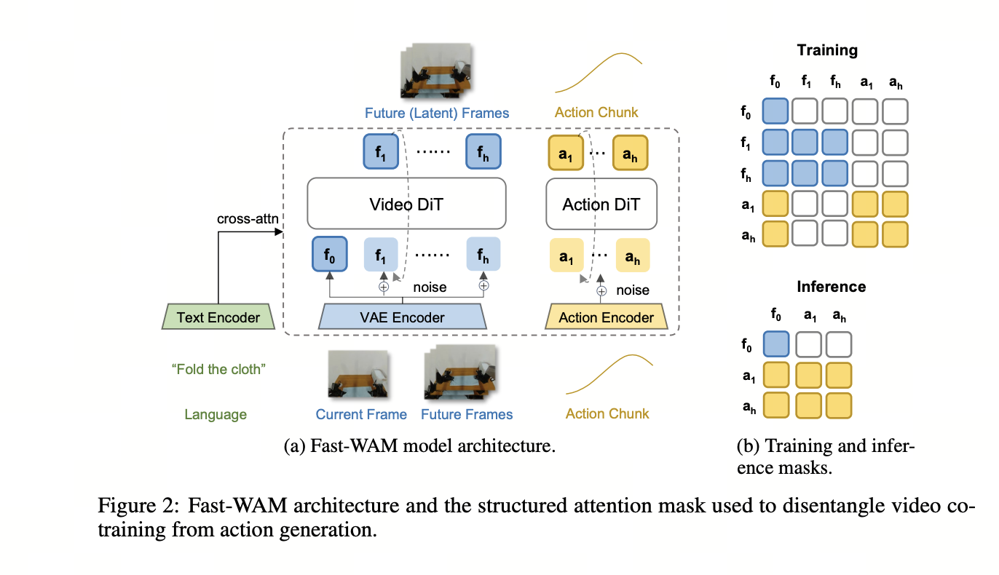

论文的对比显示，在其评测设置中，删除训练期视频目标的损害大于删除测试期想象，当然，可能是受限于资源，这只能证明显式未来并非文章中的仿真任务上的必要条件，还不能证明所有任务都不需要 video rollout。

### Motus

*Motus: A Unified Latent Action World Model*

用的是现在全世界无论是unify界还是具身界都最在用的 Mixture\-of\-Transformers（MoT） 连接理解、视频生成和动作三个 expert，并通过视频、动作各自独立的时间步实现五种推理模式：

$\text{VLA},\quad
\text{WM},\quad
\text{IDM},\quad
\text{VGM},\quad
\text{Video-Action Joint}.$

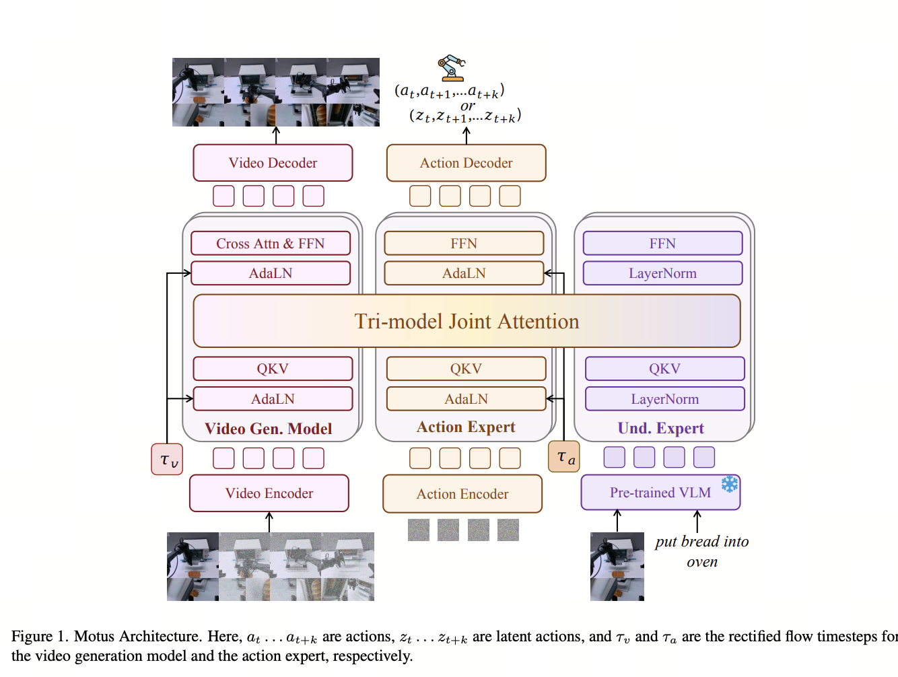

Motus 还通过 optical flow 训练了latent action vae 压缩“delta action”，以跨数据源学习运动先验。这个操作其实会跟之后我们讲的lapa adaworld以及repwam有些相似，实际上都是想给无action标签的视频通过重建打一个伪标签方便模型学习\.

### Cosmos Policy

*Cosmos Policy: Fine\-Tuning Video Models for Visuomotor Control and Planning*

还记得最早大家做video gen，其实最喜欢的就是画world model的大饼：如果做了什么，世界模型会怎样。

Cosmos Policy就是还记得最初的梦想，在predict未来的同时还是predict value，评估这个动作的价值

具体而言，它不增加独立 action transformer，将机器人 action、proprioception 和 value 归一化后复制、reshape 成与视频 VAE latent 相同形状的“伪 latent frame”，再与当前图像、未来图像 latent 拼成统一序列，通过 latent frame injection 微调 Cosmos\-Predict2：

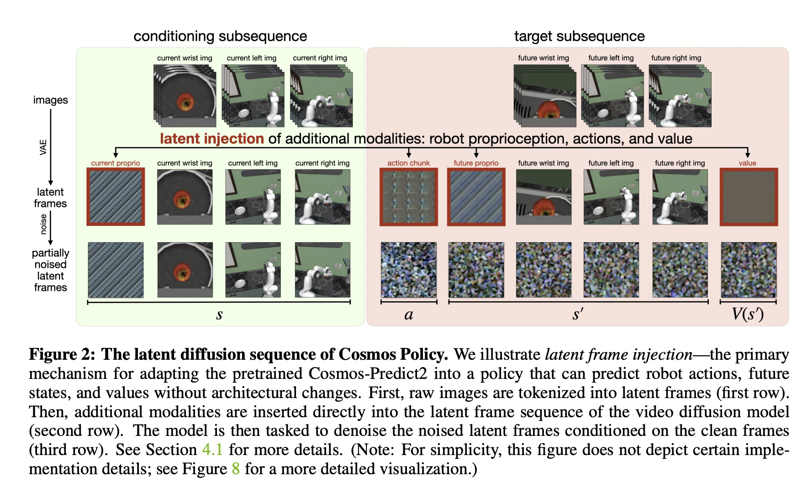

训练时仅通过不同的 conditioning mask，让同一个 diffusion backbone 分别学习 \(p(a,s',V\mid s)\)（policy）、\(p(s',V\mid s,a)\)（world model）和 \(p(V\mid s,a,s')\)（value）。推理时既可直接生成 action，也可用 **Best\-of\-\(N\)**：采样多个 action → world model 想象对应未来状态 → value model 打分 → 选择价值最高的 action


### LingBot\-VA

*Causal World Modeling for Robot Control* 

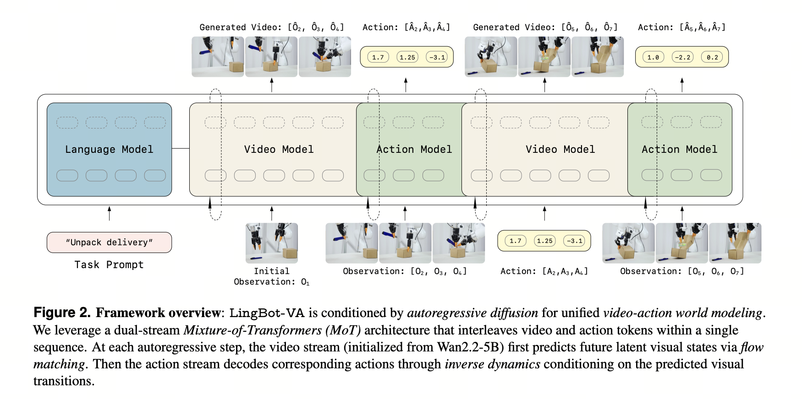

伟大的集大成之作啊：

chunk自回归，MoT，下采样视觉（每 4 个动作时刻，只保留一个视觉时刻）；teacher forcing训练 推理执行后重新观察真实世界更新，，Noisy History Augmentation让模型更鲁棒，视觉latent可以只去噪一部分（3 步 / 0.6），action维度低交互attention的时候映射到video（）

```Plain Text
1. 相机以较低频率提供视觉
   每个视觉状态对应 4 个高频动作
            ↓
2. 真实历史视频 + 历史动作进入 KV cache
            ↓
3. Video stream 从噪声预测未来视频 latent
   只跑 3 步，到 s=0.6
            ↓
4. 部分去噪的未来视频 token
   与 action token 做联合 attention
   action 768 → 3072 → attention → 768
            ↓
5. Action stream 完整去噪到 s=1
   输出可执行动作
            ↓
6. 机器人执行动作
            ↓
7. 相机重新观察真实世界
   用真实视觉替代长期生成历史
            ↓
8. 开始下一轮
```

### Cosmos3

*Cosmos 3: Omnimodal World Models for Physical AI*


是的！还是MoT！还是联合去噪！

值得再聊聊action encoder，是一堆 domain\-specific Linear Projection，而不是平常一个共享的 input MLP。

先将不同 embodiment 的动作统一表示为 ego pose / effector pose / grasp state，再通过各 embodiment 独立的 Linear映射过去。

### Qwen\-RobotWorld

*Qwen\-RobotWorld Technical Report* 


Qwen\-Image 的 Robo 场景的Video Gen版

把**自然语言当成统一的 Action Space**：不管是机械臂关节动作、自动驾驶控制还是导航指令，都转换成语言，然后统一建模为“**当前视觉状态 \+ 语言动作 → 未来视频**”。模型使用 60 层 Double\-Stream MMDiT，一路输入冻结的 Qwen2\.5\-VL 提取的动作语义，另一路输入 VAE 的视频 latent，并通过逐层 joint attention 融合。数据上构建 EWK，包含约 860 万视频文本对、2 亿\+帧、20\+种 embodiment 和 500\+动作类别；训练则先用 T2I/T2V/TI2V 学 general world prior，再持续混入 general data 的同时逐步增加单视角、多视角、复杂 manipulation、driving/navigation 等 embodied 数据进行 specialization。

### Motusbrain

*Motubrain: An Advanced World Action Model for Robot Control*

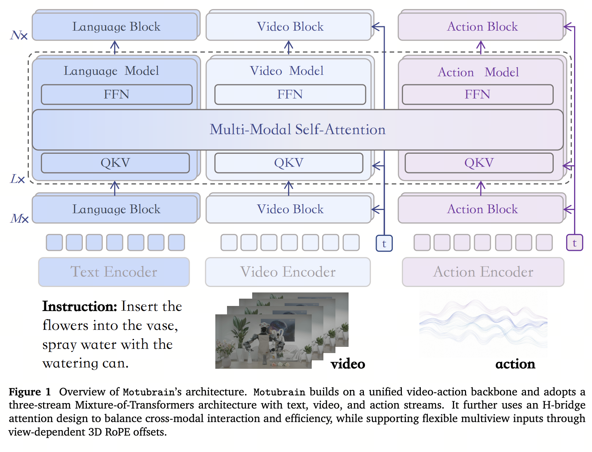

MoT again again\. 不同的是为了降低跨模态计算量，只在中间 50% Transformer 层进行 Video–Action joint attention（H\-Bridge），其余层保持 modality\-specific。同时支持 VLA policy、world model、video generation、IDM 和 video\-action joint prediction。模型从 Vidu 视频生成模型初始化，先用 egocentric \+ heterogeneous robot data 训练 video/world branch，再冻结 video branch、训练 action branch；不同机器人统一到以当前末端执行器状态为参考的 relative EEF action，每个 EEF 用 position \+ 6D rotation \+ gripper 共 10 维表示。随后针对目标机器人做 Non\-AR 或 chunk\-level AR post\-training，并采用 V2A asymmetric attention，使 action 可以看 video/text。

### τ0\-WM

*τ0\-WM: A Unified Video\-Action World Model for Robotic Manipulation*


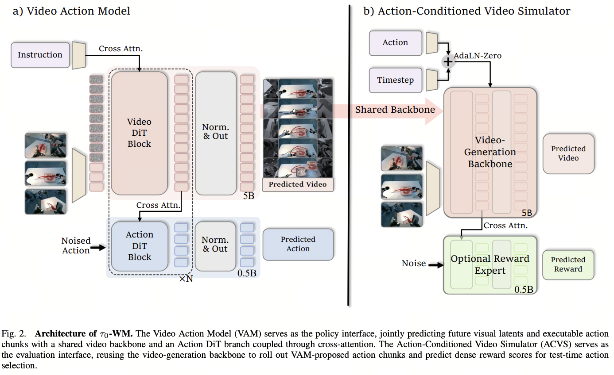

推理时，VAM 首先根据当前 observation、instruction 和 robot state，从不同 Gaussian noise 出发采样多个 action candidates。随后使用 **RCS（Re\-denoising Consistency Score）** 对这些动作做低成本筛选：将每个候选 action 重新加噪到某个中间 flow timestep，再送回同一个 VAM 的 Action DiT，预测对应的 flow velocity，并与理论目标的v计算 MSE；RCS 定义为该误差的负值，RCS 越高，说明该 action 位于 VAM 学到的 action manifold 上越稳定、越可信。（这个claim很有意思，不过还是需要进一步的验证之类的，尤其是与成本的trade\-off）

此外还有个 一个约 0\.5B 的 Reward Expert 通过 cross\-attention 读取 Video DiT 的中间特征，预测 dense reward trajectory。对多个 action 分别得到对应的 future 和 reward 后，选择 reward 最高的未来；必要时再将这个高 reward future 作为条件送回 VAM，重新生成更合适的 action 后执行。

想法上非常非常有趣，当然，是否work还是需要更完整的消融与更大规模的scale\.

### LDA\-1B

*LDA\-1B: Scaling Latent Dynamics Action Model via Universal Embodied Data Ingestion*


MM\-DiT！

一个claim的是各种数据都是有用的，高质量轨迹同时训练 policy 和 dynamics；低质量/次优轨迹不直接教 policy，而主要训练 forward dynamics / visual forecasting；没有 action label 的人类视频只训练 visual forecasting。未来视觉状态也不在 pixel/VAE latent 中预测，而是在冻结的 **DINOv3 feature space** （还是那句话，真希望有一天真能出现一个很棒的for robo的encoder哇，当然，这个事情目前来看可能会是自上而下，先有一个general表征，再垂到robo teak上的）中预测。模型主体是约 1B MM\-DiT：action token 和 DINO visual token 各自拥有 modality\-specific QKV/FFN，但进入共享 attention 相互交互，Qwen3\-VL 提供语言/当前视觉语义条件；action 以 10 Hz、visual 以 3 Hz 建模，二者通过 Flow Matching 同时进行去噪预测。

### **LingBot\-VA 2\.0**

*Native Video\-Action Pretraining for Generalizable Robot Control* 

其实我已经反复看几遍了，但是这次写blog还是忍不住想 真吊啊真吊啊，要么现在只能看一篇WAM，那绝对是LingBot\-VA2。

1. RepWAM的Encoder

2. native 因果生成（我太爱这个了），Next Forcing 用来MTP

3. action\-video from scratch pretrain

4. MoE基模（基建应该是得力于LingBot\-Video，也是非常棒的作品）

5. 甚至赠送 In\-context learning

下面我们来具体聊下 repwam和next\-forcing

#### Action Encoder

讲repwam前，我们先讲一些前置工作，包包饺子

##### LAPA

*Latent Action Pretraining from Videos* 

这篇并不是wam，但是这篇的思想影响蛮多的。

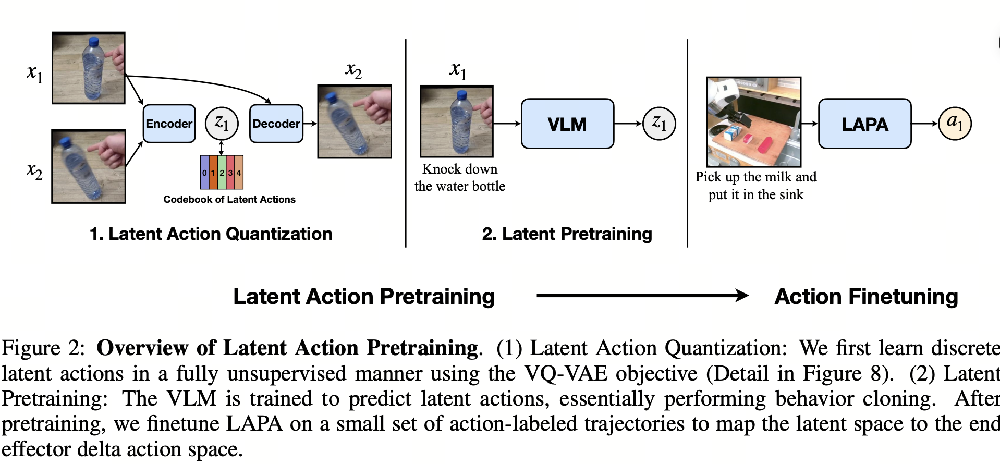

简而言之，就是训练了一个离散vq码本，目标是解决“互联网视频没有机器人动作标签，无法直接用于 VLA 预训练“的问题。它先用前后视频帧训练一个 latent action tokenizer，把视觉变化压缩成离散的动作 token；再让 VLM 根据当前图像和语言指令预测这些 token，从而学习物体交互和动作先验；最后在少量机器人数据上替换为真实 action head 并整体微调。

##### AdaWorld

*AdaWorld: Learning Adaptable World Models with Latent Actions*

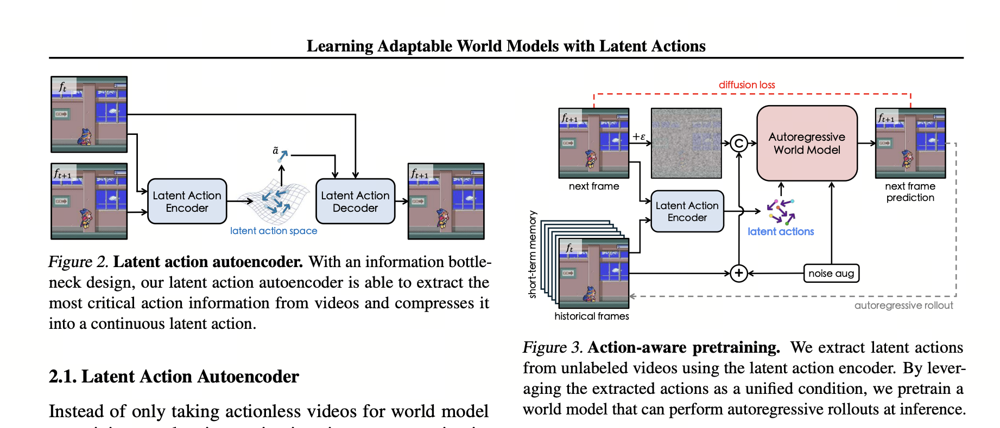

跟LAPA类似，但是从vq换成了为世界模型准备的VAE，从相邻视频帧中提取连续 latent action，使该变量描述“当前状态如何变化到下一状态”；再训练 diffusion world model，根据历史帧和 latent action 生成未来帧，后面作者团队应该是将这套上到了DreamDojo，非常棒的工作。

##### *RepWAM*

*RepWAM: World Action Modeling with Representation Visual\-Action Tokenizers*

饺子包完了，现在开始讲醋

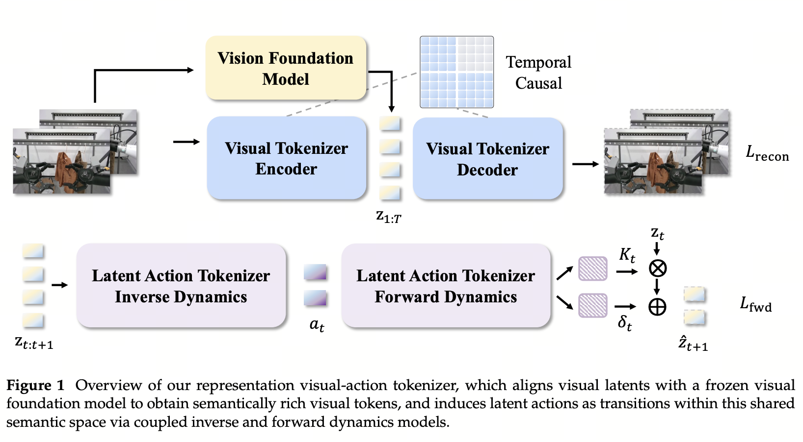

Again, RepWAM 重新设计了 WAM 的 visual/action latent space。首先训练一个 RepViTok semantic visual tokenizer：仍然采用 ViT Autoencoder，并结合像素重建损失、perceptual loss 和 GAN loss 保证视频重建质量，同时额外将 video latent 对齐到冻结的视觉基础模型 Perception Encoder 特征，使 latent 不只保留纹理，还显式包含 object identity、spatial relation 等高层语义。随后在该 semantic visual latent 上训练 Latent Action Tokenizer（LAT）：IDM 根据相邻两帧的 visual latent，将“状态如何发生变化”压缩成一个 4 维 latent action；FDM 再根据当前 visual latent 和 latent action，预测 token 之间的 transport 关系以及 residual，从而重建下一时刻的 latent。

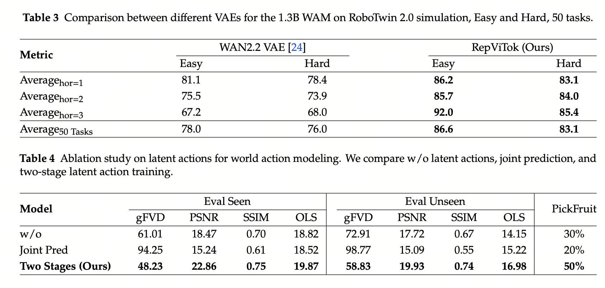

我一向是非常喜欢这类表征encoder类的工作的，我觉得是一个非常好的方向，如何得到一个重建/可学性/压缩率 tradeoff好的encoder此事在图片生成早有记载，并且我也之前写过一篇blog讲述它的演进，尽管我最后叛逃选择了去除encoder\(。

#### Next Forcing

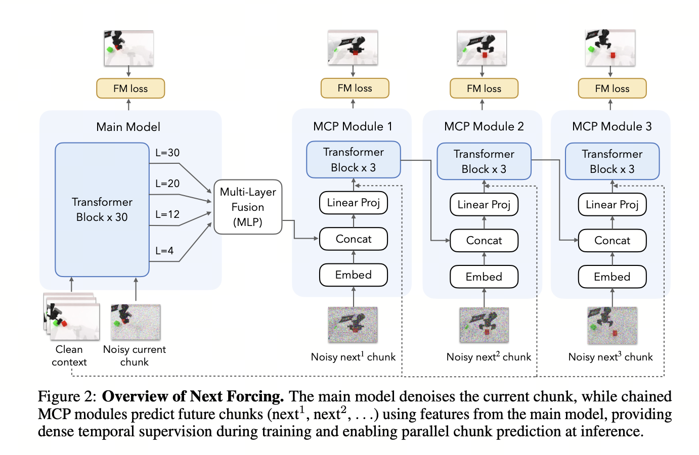

Next Forcing 认为传统 WAM 的 teacher forcing 只监督“当前 next chunk”，尤其在高帧率下相邻 chunk 几乎一样，模型很容易通过“复制上一帧外观 \+ 小修正”完成 denoising，而不必真正学习。（此事streaming video gen亦有记载）

为此，它在 LingBot\-VA 的 video stream 上增加 3 个轻量 **Multi\-Chunk Prediction（MCP）模块**，让主模型预测当前 chunk 的同时，额外预测 `next¹ / next² / next³` 三个未来 chunk。具体来说，未来 chunk 各自独立加噪并做 Flow Matching；MCP 使用比主模型更大的 timestep shift（默认 $s_{\mathrm{main}}=5,\ s_{\mathrm{mcp}}=10$），故意把未来 target 加得更 noisy，使 MCP 更依赖主干提供的 temporal representation；同时取主模型第 $\{4,12,20,30\}$ 层 hidden states，经 MLP 融合后送入 MCP，并让三个 MCP 形成 `next1 → next2 → next3` 的 causal chain。整体目标为

$$
\begin{aligned}
\mathcal{L}
&=
\mathcal{L}_{\mathrm{video}}
+
\mathcal{L}_{\mathrm{action}}
+
\sum_{k=1}^{3} w_k \mathcal{L}_{\mathrm{MCP}}^{k}.
\end{aligned}
$$

默认 $w=(0.5,0.2,0.1)$。MCP 本身只作用于 video stream，action stream 仍沿用 LingBot\-VA 的 inverse\-dynamics Flow Matching，通过 MoT 中的跨模态交互间接受益。推理时 MCP 可以全部扔掉，实现与原模型相同 inference cost；也可以保留第一个 MCP，让主模型生成当前 chunk 的同时 MCP 并行生成下一个 chunk。

