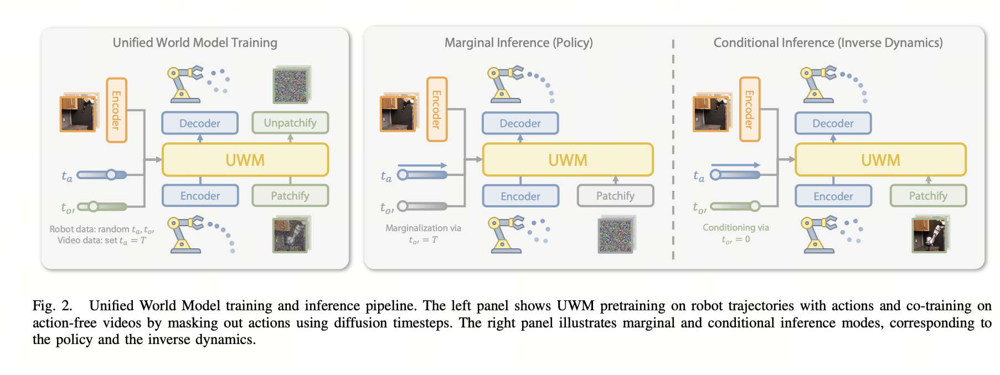
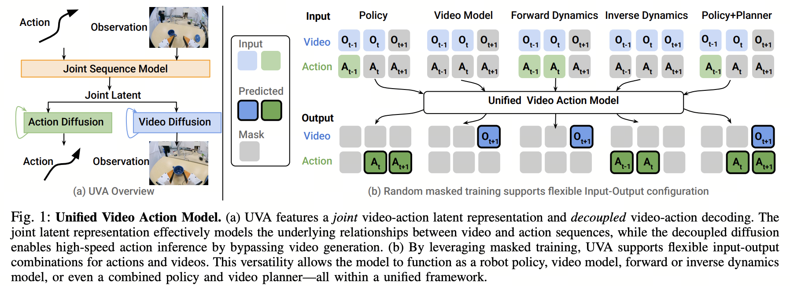
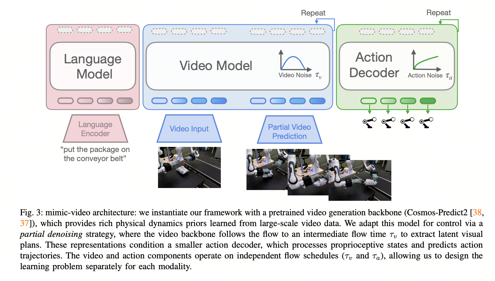
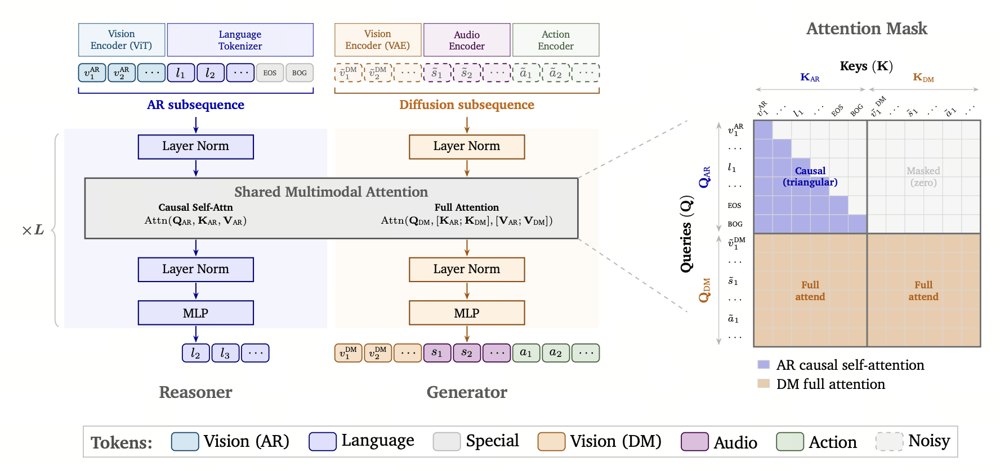
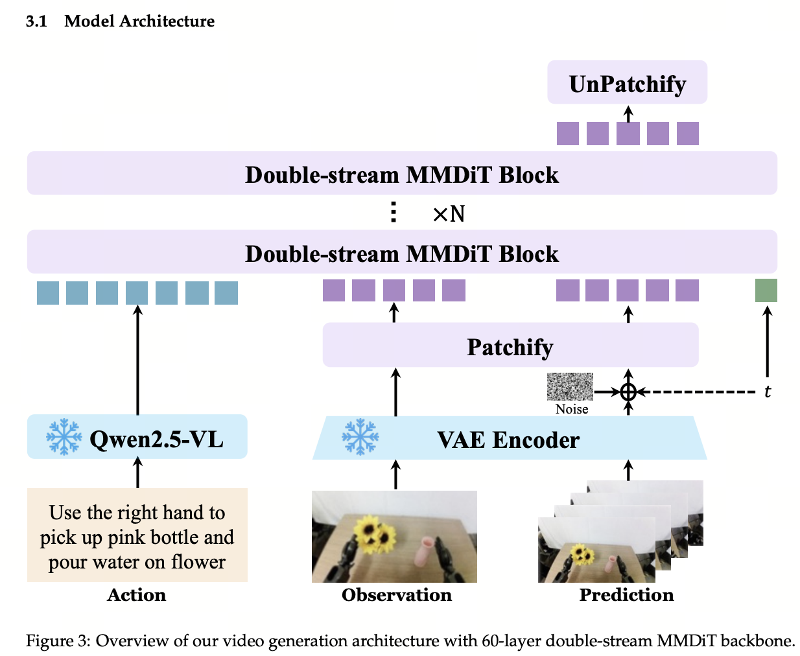
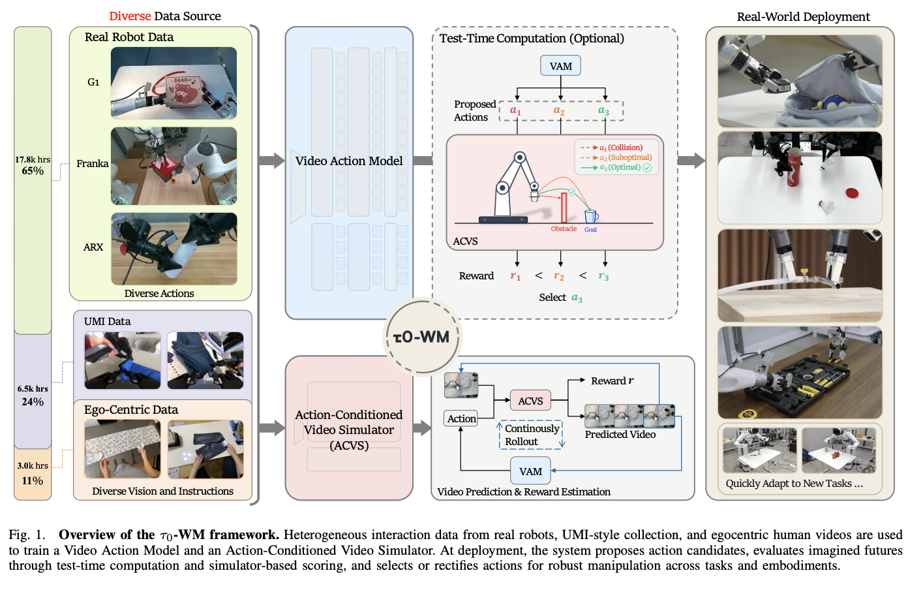
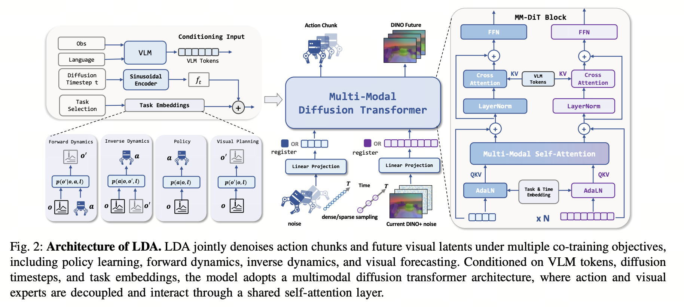

# World Action Model: From Video Generation Priors to Robot Actions

### UniPi

*Learning Universal Policies via Text\-Guided Video Generation*

It strictly divides control into two steps: visual planning and action decoding.


$(o_t,l)
\rightarrow
\text{text-guided video diffusion}
\rightarrow
\hat{o}_{t+1:t+K}
\rightarrow
\text{inverse dynamics}
\rightarrow
a_{t:t+H}.$

When training the video planner, one can use simulated trajectories, real robot videos, and action-free videos from sources such as YouTube, because the video loss requires only observation sequences; the grounding in actual robot actions is handled by an IDM trained on action-labeled data. At inference time, future RGB plans must first be generated. Video is not an auxiliary loss, but an intermediate variable required for producing actions. Its advantages are that plans are visualizable and the planner is not tied to a single embodiment. Its limitations are that video-generation errors, temporal-alignment errors, and IDM errors can propagate through the pipeline, while full video denoising also incurs substantial overhead.

### PAD

*Prediction with Action: Visual Policy Learning via Joint Denoising Process*

Instead of using the sequential “video first, IDM second” approach, PAD denoises future images and actions simultaneously within the same DiT:


$(o_t,s_t,l,\epsilon_{\text{video}},\epsilon_a)
\rightarrow
\text{joint DiT denoising}
\rightarrow
(\hat{o}_{t+1:t+K},\hat{a}_{t:t+H}).$

Action-labeled robot trajectories supervise both outputs simultaneously. For action-free videos, the action tokens can be replaced with masks so that only the visual-prediction component is updated; through the shared transformer, they still indirectly affect the action representations. At inference time, the model continues to perform joint future prediction and action generation, with actions and video sharing the same backbone.

### UWM

*Unified World Models*


UWM places video and actions in the same diffusion process while using independent diffusion timesteps for the two. The unified model learns the joint distribution $p(o,a,o')$. By adjusting the noise level of each modality, it can query:



$p(a\mid o),\quad
p(o'\mid o,a),\quad
p(a\mid o,o'),\quad
p(o'\mid o).$

During policy inference, the diffusion timestep of future images is fixed at the maximum noise level $T$, which is equivalent to marginalizing them out, and only the actions are denoised. For action-free videos, the action modality is instead kept at maximum noise and only actions are trained; video does not need to be inferred at inference time either. The action-free data in the paper’s experiments primarily consists of robot videos whose action labels are ignored, rather than large-scale ordinary Internet videos.

### UVA

*Unified Video Action Model*



Another magical masking moment: masked training lets the model serve as a policy, video generator, forward-dynamics model, or IDM. In standard policy mode, the action head is invoked directly from the shared latent, without relying on video generation. The difference from UWM is that UWM performs joint modeling in the diffusion process and backbone parameters, whereas UVA performs joint modeling in the shared latent representation but uses two separate modality heads for output decoding. This makes action diffusion faster.

### VPP

*Video Prediction Policy*

VPP uses two-stage training. In the first stage, Internet videos of human manipulation, Internet videos of robot manipulation, and downstream robot videos are used to fine-tune Stable Video Diffusion into a text-conditioned Manipulation TVP. In the second stage, the TVP is frozen:


$(o_t,l,\epsilon_{\text{future}})
\rightarrow
\text{one TVP forward pass}
\rightarrow
h_{\text{predictive}}
\rightarrow
\text{Video-Former}
\rightarrow
\text{diffusion action head}.$

The predictive visual representation is extracted directly from intermediate layers during the first forward pass. The action head is effectively an implicit IDM.

***From here on, we enter the era of modern WAMs.***

### mimic\-video

*mimic\-video: Video\-Action Models for Generalizable Robot Control Beyond VLAs*

I really like this paper.


One of the classic opening moves: VLAs do not work!



$(o_{\text{past}},l,\epsilon_{\text{future}})
\rightarrow
\text{partial video flow}
\rightarrow
h^{\tau_v}_{\text{video}}
\rightarrow
\text{action flow/IDM}
\rightarrow
a_{t:t+H}.$

- Video backbone: the pretrained video diffusion model Cosmos\-Predict2, LoRA-fine-tuned on robot videos.

- Action decoder: a lightweight flow-matching decoder that acts as the IDM, conditioned on intermediate latent representations from the video backbone.

- Two-stage training: ① LoRA-fine-tune the video backbone; ② freeze the backbone and train the action decoder from scratch.

- Partial denoising: select intermediate-layer representations from high-noise denoising steps, similarly to VPP. Appendix D explains the reasons and is very much worth savoring. Here is my brief understanding:

    1. It alleviates the train–inference gap (does this remind you of RAE and diffusion forcing? hhh).

    2. High noise acts as regularization.

    3. At high noise levels, the model is at its best as a representation learner; at low noise levels, it is merely refining.

    4. An action policy does not need the video with the highest pixel quality, but rather the internal video-generation representation most useful for action.

### DreamZero

*World Action Models are Zero\-shot Policies*

DreamZero seems to be the work that coined the name WAM. WAMs’ current popularity is also partly due to Jim Fan’s enthusiastic promotion.

I think the WAM advantages mentioned at the beginning of DreamZero deserve deeper exploration:

1. efficiently learning from diverse, non-repetitive data;

2. open-world generalization;

3. cross-embodiment learning solely from video data;

4. few-shot adaptation to new robots.

Its approach is to use an autoregressive video DiT that jointly performs flow matching over video latents and actions within a single model.


In other words, it is an end-to-end combination of video prediction and IDM, with shared timesteps and joint denoising. At inference time, each chunk generates future visual representations and the corresponding actions. After the actions are executed, the predicted frames in the KV cache are replaced with real observations to limit long-term error accumulation. (This is a classic move; LingBot\-VA will also use it later.) DreamZero\-Flash decouples the noise schedules so that, when action denoising finishes, the video representation for the current chunk can remain at a relatively high noise level, thereby accelerating inference.

There are also a few findings: WAMs exhibit a degree of OOD generalization; diversity matters more than repetition; the video backbone shows a clear scaling effect; AR and bidirectional architectures have the same average score, but AR produces smoother actions, supports KV caching, runs 3–4 times faster at inference, and more readily maintains language–video–action temporal alignment; video-only cross-embodiment data is effective; robots generally execute the plan from the video branch faithfully, with the main failures coming from incorrect video planning rather than failure to extract actions; and human video data improves performance on unseen tasks.

Of course, because DreamZero is a model-release tech report, in some cases it may be very, very difficult for its ablations to be completely flawless.

### Fast\-WAM

*Fast\-WAM: Do World Action Models Need Test\-time Future Imagination?*

Fast\-WAM specifically examines whether “video prediction during training” must be coupled with “future imagination during inference”: is the useful part the representation learned during training, or the video generated at inference time? During training, both future video latents and actions receive flow-matching losses, but an attention mask prevents action tokens from seeing future video tokens; at inference time, the model outputs actions directly. I think this is a great academic paper. Although the idea it investigates may have been mentioned in earlier papers, embodied intelligence needs many more papers of this kind that concretely investigate whether a phenomenon truly exists and exactly what its mechanism is.


The paper’s comparisons show that, in its evaluation setting, removing the training-time video objective is more harmful than removing test-time imagination. Of course, perhaps due to resource limitations, this can only demonstrate that explicit futures are not a necessary condition for the simulated tasks in the paper; it cannot prove that no task requires video rollout.

### Motus

*Motus: A Unified Latent Action World Model*

It uses Mixture\-of\-Transformers (MoT)—currently all the rage worldwide in both the unification and embodied-intelligence communities—to connect three experts for understanding, video generation, and action. With independent timesteps for video and actions, it supports five inference modes:

$\text{VLA},\quad
\text{WM},\quad
\text{IDM},\quad
\text{VGM},\quad
\text{Video-Action Joint}.$


Motus also trains a latent-action VAE with optical flow to compress “delta actions,” thereby learning motion priors across data sources. This operation is somewhat similar to LAPA, AdaWorld, and RepWAM, which we will discuss later. In essence, all of them seek to assign reconstruction-based pseudo-labels to videos without action annotations so that the model can learn from them.

### Cosmos Policy

*Cosmos Policy: Fine\-Tuning Video Models for Visuomotor Control and Planning*

Remember how, when everyone first started working on video generation, their favorite grand vision for world models was: if I do something, what will happen in the world?

Cosmos Policy remembers that original dream: while predicting the future, it also predicts value to assess the value of the action.

More specifically, it does not add a separate action transformer. Instead, robot actions, proprioception, and value are normalized, copied, and reshaped into “pseudo-latent frames” with the same shape as video VAE latents. These are then concatenated with the current-image and future-image latents into a unified sequence, and Cosmos\-Predict2 is fine-tuned through latent frame injection:


During training, different conditioning masks alone allow the same diffusion backbone to learn $p(a,s',V\mid s)$ (policy), $p(s',V\mid s,a)$ (world model), and $p(V\mid s,a,s')$ (value). At inference time, it can either generate actions directly or use **Best\-of\-$N$**: sample multiple actions → use the world model to imagine the corresponding future states → score them with the value model → choose the action with the highest value.

### LingBot\-VA

*Causal World Modeling for Robot Control*


What a magnificent synthesis of everything that came before:

chunk-level autoregression, MoT, downsampled vision (keeping only one visual timestep for every four action timesteps); teacher-forcing training, followed by re-observation of the real world after execution to update the context; Noisy History Augmentation to make the model more robust; visual latents can be only partially denoised (3 steps / 0.6); and when low-dimensional actions interact through attention, they are projected into the video dimensionality ().

```Plain Text
1. The camera provides visual input at a lower frequency
   Each visual state corresponds to 4 high-frequency actions
            ↓
2. Real video history + action history enter the KV cache
            ↓
3. The video stream predicts future video latents from noise
   It runs for only 3 steps, up to s=0.6
            ↓
4. The partially denoised future video tokens
   perform joint attention with action tokens
   action 768 → 3072 → attention → 768
            ↓
5. The action stream is fully denoised to s=1
   and outputs executable actions
            ↓
6. The robot executes the actions
            ↓
7. The camera observes the real world again
   Real visual input replaces the long-term generated history
            ↓
8. The next round begins
```

### Cosmos3

*Cosmos 3: Omnimodal World Models for Physical AI*



Yes! MoT again! Joint denoising again!

The action encoder is also worth discussing: it consists of a collection of domain-specific linear projections rather than the usual single shared input MLP.

Actions from different embodiments are first represented uniformly as ego pose / effector pose / grasp state, and then mapped through a separate linear projection for each embodiment.

### Qwen\-RobotWorld

*Qwen\-RobotWorld Technical Report*



The video-generation version of Qwen\-Image for robotic scenarios.

It treats **natural language as a unified action space**: whether the input consists of robotic-arm joint actions, autonomous-driving controls, or navigation commands, everything is converted into language and uniformly modeled as “**current visual state + language action → future video**.” The model uses a 60-layer Double\-Stream MMDiT. One stream takes in action semantics extracted by a frozen Qwen2\.5\-VL, while the other takes in video latents from a VAE; the two are fused through joint attention layer by layer. For data, it constructs EWK, containing approximately 8.6 million video–text pairs, more than 200 million frames, over 20 embodiments, and over 500 action categories. Training first uses T2I/T2V/TI2V to learn a general world prior, then performs specialization by gradually adding embodied data—including single-view, multi-view, complex manipulation, and driving/navigation data—while continuously mixing in general data.

### Motusbrain

*Motubrain: An Advanced World Action Model for Robot Control*


MoT again, again. The difference is that, to reduce cross-modal computation, Video–Action joint attention is applied only in the middle 50% of the Transformer layers (the H\-Bridge), while the remaining layers stay modality-specific. It supports VLA policy, world model, video generation, IDM, and joint video-action prediction. The model is initialized from the Vidu video-generation model. First, its video/world branch is trained with egocentric + heterogeneous robot data; then the video branch is frozen and the action branch is trained. Different robots are unified into relative EEF actions referenced to the current end-effector state. Each EEF is represented by 10 dimensions: position + 6D rotation + gripper. It then undergoes Non\-AR or chunk-level AR post-training for the target robot and uses V2A asymmetric attention, allowing actions to attend to video/text.

### τ0\-WM

*τ0\-WM: A Unified Video\-Action World Model for Robotic Manipulation*




At inference time, the VAM first samples multiple action candidates from different Gaussian noise initializations, conditioned on the current observation, instruction, and robot state. It then uses **RCS (Re\-denoising Consistency Score)** to screen these actions at low cost: each candidate action is re-noised to an intermediate flow timestep and fed back into the same VAM’s Action DiT, which predicts the corresponding flow velocity. The MSE between that prediction and the theoretical target $v$ is then computed. RCS is defined as the negative of this error: the higher the RCS, the more stably the action lies on the action manifold learned by the VAM, and thus the more trustworthy it is. (This claim is very interesting, though it still needs further validation, especially regarding the cost trade-off.)

There is also an approximately 0.5B-parameter Reward Expert that reads intermediate features from the Video DiT through cross-attention and predicts a dense reward trajectory. After obtaining the corresponding future and reward for each of multiple actions, the model selects the future with the highest reward. When necessary, this high-reward future is fed back into the VAM as a condition so that a more suitable action can be regenerated and executed.

The idea is extremely, extremely interesting. Of course, whether it works still requires more complete ablations and larger-scale experiments.

### LDA\-1B

*LDA\-1B: Scaling Latent Dynamics Action Model via Universal Embodied Data Ingestion*



MM\-DiT!

One claim is that all kinds of data are useful. High-quality trajectories jointly train the policy and dynamics; low-quality/suboptimal trajectories do not directly teach the policy, but primarily train forward dynamics / visual forecasting; human videos without action labels train visual forecasting only. Future visual states are not predicted in pixel/VAE latent space either, but in a frozen **DINOv3 feature space**. (As I always say, I truly hope that one day we will have a great encoder for robotics. Of course, as things currently stand, this may happen top-down: first a general representation, then one that trickles down to robotics tasks.) The main model is an approximately 1B-parameter MM\-DiT: action tokens and DINO visual tokens each have modality-specific QKV/FFN modules but interact through shared attention, while Qwen3\-VL provides language/current-vision semantic conditioning. Actions are modeled at 10 Hz and vision at 3 Hz, and both are denoised and predicted simultaneously through Flow Matching.

### **LingBot\-VA 2\.0**

*Native Video\-Action Pretraining for Generalizable Robot Control*

I have actually read it several times already, but while writing this blog I still cannot help thinking: this is absolutely amazing, absolutely amazing. If you could read only one WAM paper right now, it would definitely have to be LingBot\-VA 2.

1. RepWAM’s encoder

2. native causal generation (I love this so much), with Next Forcing for MTP

3. action-video pretraining from scratch

4. an MoE foundation model (the infrastructure probably owes much to LingBot\-Video, which is also excellent work)

5. it even throws in in-context learning

Below, let us discuss RepWAM and Next Forcing in detail.

#### Action Encoder

Before discussing RepWAM, let us first cover some preliminary work—time to wrap the dumplings.

##### LAPA

*Latent Action Pretraining from Videos*

This is not a WAM paper, but its ideas have been quite influential.


In short, it trains a discrete VQ codebook to address the problem that “Internet videos do not have robot-action labels and therefore cannot be directly used for VLA pretraining.” It first trains a latent-action tokenizer on pairs of preceding and following video frames, compressing visual changes into discrete action tokens. It then asks a VLM to predict these tokens from the current image and language instruction, thereby learning object-interaction and action priors. Finally, the latent-action prediction module is replaced with a real action head on a small amount of robot data, and the entire model is fine-tuned.

##### AdaWorld

*AdaWorld: Learning Adaptable World Models with Latent Actions*


Like LAPA, but replacing VQ with a VAE designed for a world model. It extracts a continuous latent action from adjacent video frames so that this variable describes “how the current state changes into the next state.” It then trains a diffusion world model to generate future frames from historical frames and the latent action. The authors’ team later appears to have brought this approach into DreamDojo—excellent work.

##### *RepWAM*

*RepWAM: World Action Modeling with Representation Visual\-Action Tokenizers*

The dumplings are wrapped; now it is time to talk about the vinegar.


Again, RepWAM redesigns the visual/action latent space of WAMs. It first trains a RepViTok semantic visual tokenizer. This still uses a ViT Autoencoder and combines a pixel-reconstruction loss, perceptual loss, and GAN loss to ensure video-reconstruction quality. At the same time, it additionally aligns video latents with features from a frozen visual foundation model, the Perception Encoder, so that the latents not only preserve texture but also explicitly contain high-level semantics such as object identity and spatial relations. A Latent Action Tokenizer (LAT) is then trained in this semantic visual latent space: given the visual latents of two adjacent frames, an IDM compresses “how the state changes” into a four-dimensional latent action; an FDM then predicts both the transport relationship between tokens and the residual from the current visual latent and latent action, thereby reconstructing the latent at the next timestep.


I have always really liked representation/encoder work of this kind. I think it is a very promising direction. The question of how to obtain an encoder with a good trade-off among reconstruction, learnability, and compression ratio has a long history in image generation, and I previously wrote a blog post about its evolution—even though, in the end, I defected and chose to remove the encoder \(.

#### Next Forcing


Next Forcing argues that conventional WAM teacher forcing supervises only the “current next chunk.” Especially at high frame rates, adjacent chunks are almost identical, so the model can easily complete denoising by “copying the previous frame’s appearance + making small corrections,” without having to truly learn. (This has also been documented in streaming video generation.)

To address this, it adds three lightweight **Multi\-Chunk Prediction (MCP) modules** to LingBot\-VA’s video stream. While the main model predicts the current chunk, these modules additionally predict three future chunks: `next¹ / next² / next³`. Specifically, each future chunk is independently noised and trained with Flow Matching. MCP uses a larger timestep shift than the main model (by default, $s_{\mathrm{main}}=5,\ s_{\mathrm{mcp}}=10$), deliberately making the future targets noisier so that MCP depends more heavily on the temporal representations provided by the backbone. Meanwhile, hidden states from layers $\{4,12,20,30\}$ of the main model are fused through an MLP and fed into MCP, and the three MCPs form a causal chain: `next1 → next2 → next3`. The overall objective is

$$
\begin{aligned}
\mathcal{L}
&=
\mathcal{L}_{\mathrm{video}}
+
\mathcal{L}_{\mathrm{action}}
+
\sum_{k=1}^{3} w_k \mathcal{L}_{\mathrm{MCP}}^{k}.
\end{aligned}
$$

The default is $w=(0.5,0.2,0.1)$. MCP itself operates only on the video stream, while the action stream continues to use LingBot\-VA’s inverse-dynamics Flow Matching and benefits indirectly through cross-modal interaction in the MoT. At inference time, all MCP modules can be discarded, giving the same inference cost as the original model; alternatively, the first MCP can be retained so that, while the main model generates the current chunk, MCP generates the next chunk in parallel.
