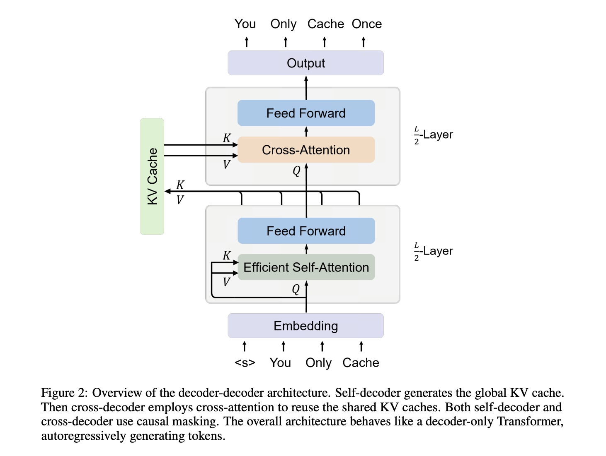
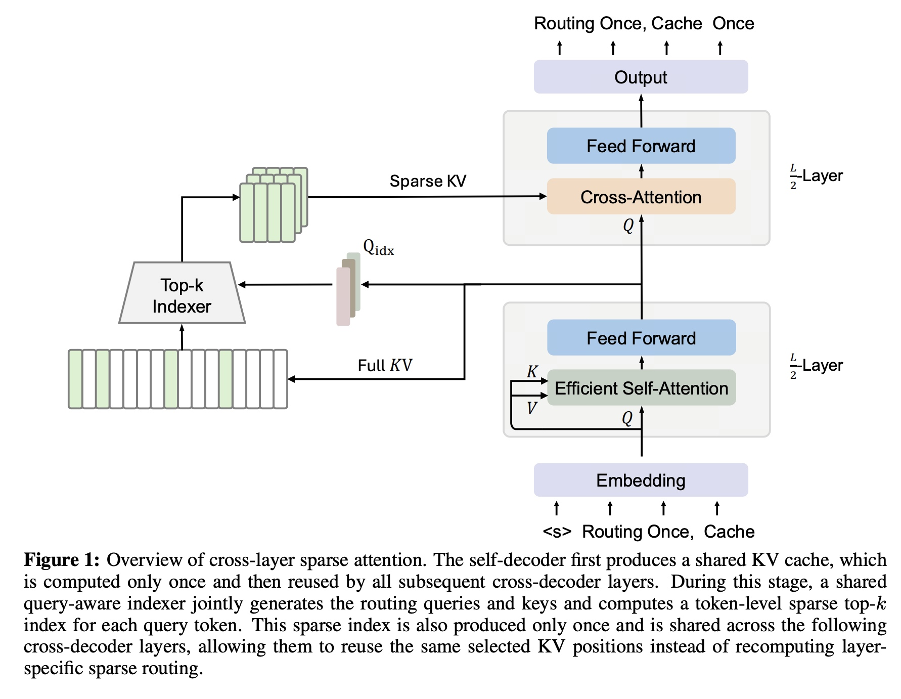

# YOCO：跨层 KV 共享

随着 DeepSeek-V4.1-Flash 的发布，YOCO 也重新进入大众视野。在我看来，YOCO 是一篇非常优秀的工作，基于 YOCO，也出现了一些有趣的变种。

YOCO 的 motivation 主要有以下两点：

1. **Prefill–Decode（PD）不对称。** Prefill 的主要工作是建立 Cache，只有最后一个 Prompt token 负责产生第一次 logits，前面的 token 都没有必要算 logits。普通 Transformer 因为每层都需要独立 KV Cache，很难充分利用这种不对称；而 YOCO 通过让后面的 Cross-Decoder 共享同一份全局 Shared KV ，使长 Prefill的前面 token 在建立 Shared KV 后即可提前退出，从而显著放大 PD 不对称带来的收益。（此事在苏神的知乎亦有记载）

2. **从 Layer 维度压缩 KV Cache。** KV Cache 可以近似看成由 entry（维度、头数）× sequence（长度）× layer（层数）三个维度共同决定。过去的工作已经从不同维度进行压缩：

    - **Entry**：GQA/MQA 减少 KV head 数，MLA 压缩单 token 的 KV 表示维度 $d_{\mathrm{KV}}$。
    - **Sequence**：CSA/HCA/Linear 等注意力减少对历史长度 $N$ 的缓存需求。
    - **Layer**：YOCO 类的方法则从层数入手，让后面层共享同一份全局 KV Cache。

## 一、YOCO

YOCO 的架构非常简单易懂：把标准 decoder-only Transformer 拆成上下两部分。

**前半部分是 Self-Decoder。** 激进一些的是，在这部分甚至采用了 gated retention 或 sliding-window attention，进一步把整个上下文压成一份**共享的全局 KV Cache**。

**后半部分是 Cross-Decoder。** 每一层不再各自保存历史 K/V，而是用自己的 Query 去 cross-attend 同一份共享 KV。

标准 Transformer 的 KV Cache 从大致 $O(LND)$ 降到：

$$
O\!\left((N+L)D\right).
$$

更妙的是，Prefill 阶段完全不需要跑后面的 Cross-Decoder（这在现在的 agent 场景的超长输入中，确实是太实用了）。

## 二、YOCO-U

{width=65%}

YOCO-U 则是对前面的 Self-Decoder 上了今年一直疑云重重、热度一波接着一波来的 **Loop**：对前面的 Self-Decoder loop 三次后产生一份 Shared KV；在 Cross-Decoder 上的改动则是采用了 **NOPE**。

{width=75%}

{width=80%}

## 三、YOCO-Sparse

YOCO-Sparse 的想法就更加干脆直接啦：既然 YOCO 后半部分的多个 Cross-Decoder layer 本来就在读取同一份 KV Cache，那干脆 **Sparse Attention 的 Routing Index 也共享**得了，堪称省中省。

## 四、DeepSeek-V4.1-Flash

DS 家一向是在压 KV 上最最最激进的，这次 4.1 更是令人“触目惊心”。

DeepSeek-V4.1-Flash 的 Attention 大致为 **YOCO/CED + CSA2 + SWA**。

### YOCO/CED：减少 Prefill 计算

Global KV 以 YOCO 为大框架，把 40 层分成 **20 层 Causal Encoder + 20 层 Decoder**。 DS自己称之为 CED 架构。

在 Prefill 时跑前 20 层，Decoder 的 Global KV 直接由 Encoder 最后一层 $H_{20}$ 通过各层独立投影生成，因此避免让整个 Prompt 再完整跑后 20 层。

### CSA2：跨层复用 Global KV 与 Top-K

在此基础上，Global Attention 用 CSA2 做跨层复用：

- **Full 层**：生成新的 Global KV 和 Top-K。
- **Reindex 层**：复用 KV，但重新选 Top-K。
- **Reuse 层**：连 KV 和 Top-K 都复用。

Decoder 中只有第一个 Full 层生成 Global KV，后续层共享这份 KV，并每隔几层通过 Reindex 更新检索位置。Global Sparse Attention 最终只读取 **Top-512 个远程 KV**。

### SWA：短期缓存与局部重建

为了进一步省存储，DeepSeek 不再把 SWA KV 长期放进 persistent cache：长期保存的主要是 Global KV，而 SWA KV 只放在短 TTL 的 host-DRAM pool 中；**Global Main KV 使用 FP4，SWA KV 保留 FP8**。

如果 SWA KV 丢失，正常来讲，由于多层 SWA 的有效感受野会随着层数成倍扩大，重建 SWA 得 replay $128\times\text{layers}$ 个 token。但是 DS V4.1 直接只 **replay 最后 128 个 token**（他真的太能省了，我哭死……）。

Decode 时，新 token 仍正常经过全部 40 层，并同时使用 **Top-512 Global Sparse KV + 128 Local SWA KV**。

\clearpage

## 五、Gemma 4 E2B / E4B

Gemma 4 其实在架构上有不少花活，而在 E2B / E4B 上也用了类似 YOCO 的技术。

说来也十分简单干脆：**后半段很多层不再计算自己的 K/V，只保留独立的 Q，并复用前面最后一个同类型 Attention 层的 KV。**

| 模型 | 总层数 | 后段共享范围 | Sliding Attention 复用来源 | Full / Global Attention 复用来源 |
| :--- | :--- | :--- | :--- | :--- |
| **Gemma 4 E2B** | 35 层 | L15–L34 | L13 的 KV | L14 的 KV |
| **Gemma 4 E4B** | 42 层 | L24–L41 | L22 的 KV | L23 的 KV |

## 六、WeLM

WeLM 也做了类似 YOCO 的操作 **KV-Mirror**，但是本质目的不是为了节省 KV Cache，而是为了**节省 Prefill 的计算**。

具体而言，他们采用 **U 形的 KV 共享策略**：前 1/3 的层镜像到后 1/3 共享，并且是复用被镜像层在 **K/V 投影前的 Hidden States（而不是 KV！）**，再用目标层的投影重新计算 K/V，也就节省了 Prefill 阶段后 1/3 层的完整 Attention 和 MoE 等计算。

至于为什么是 U 形呢？是之前有篇文章 KVSharer 发现，**共享差异更大的 layer KV，性能反而更好**。
