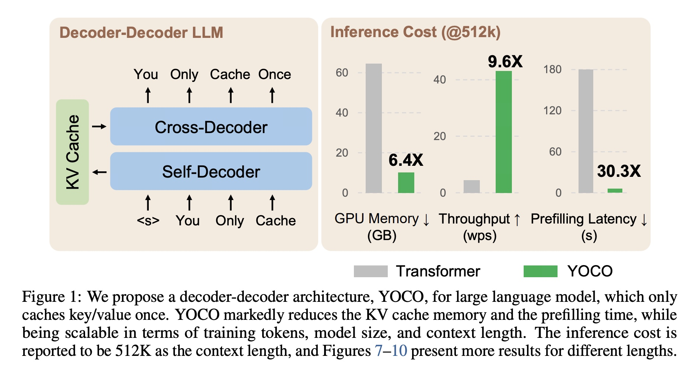
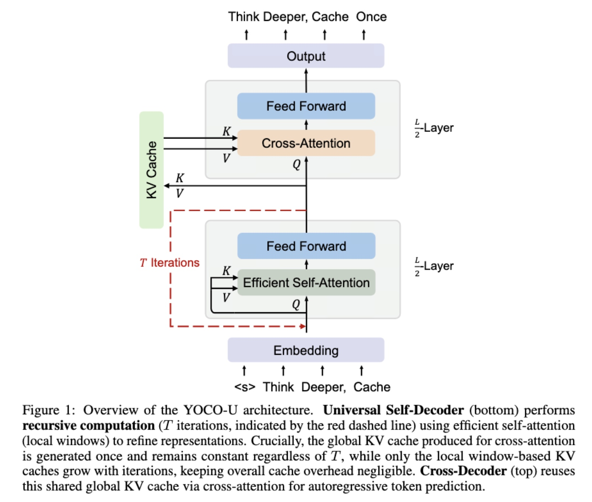
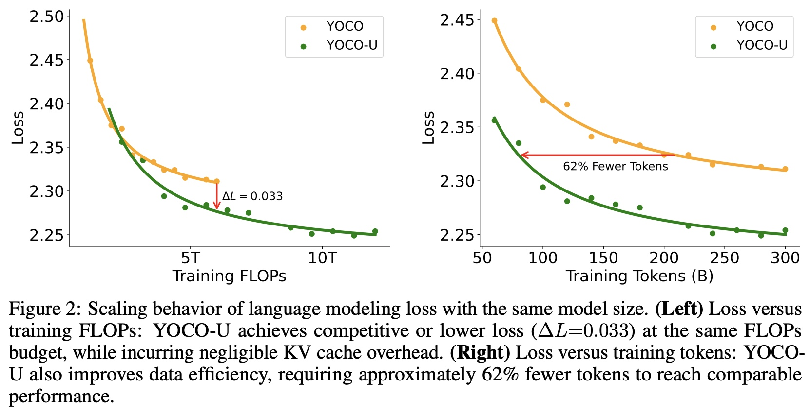
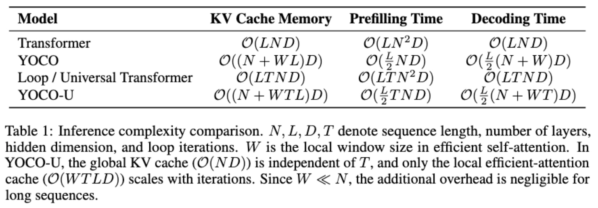
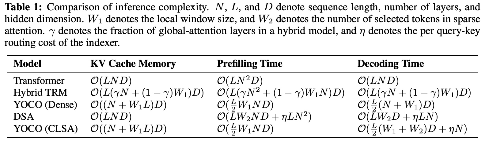
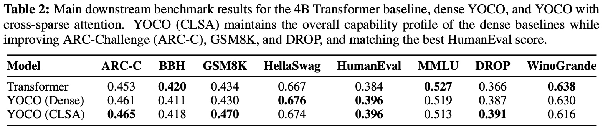
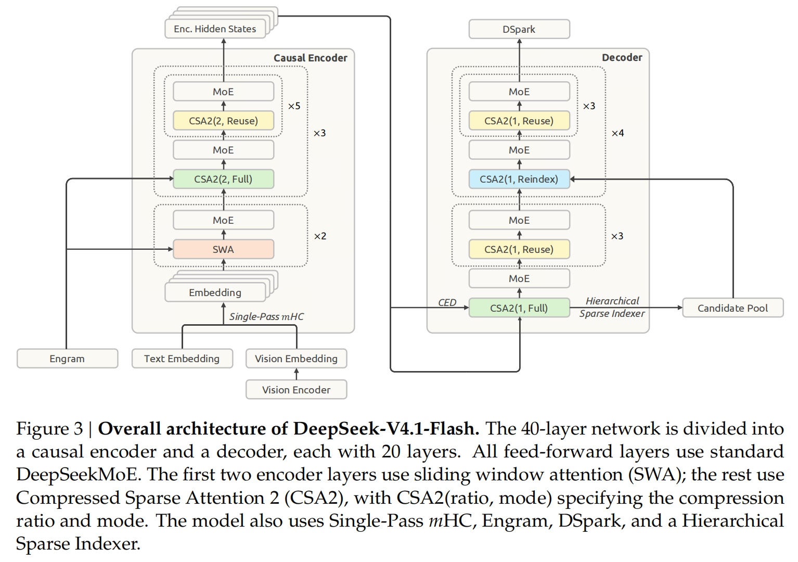
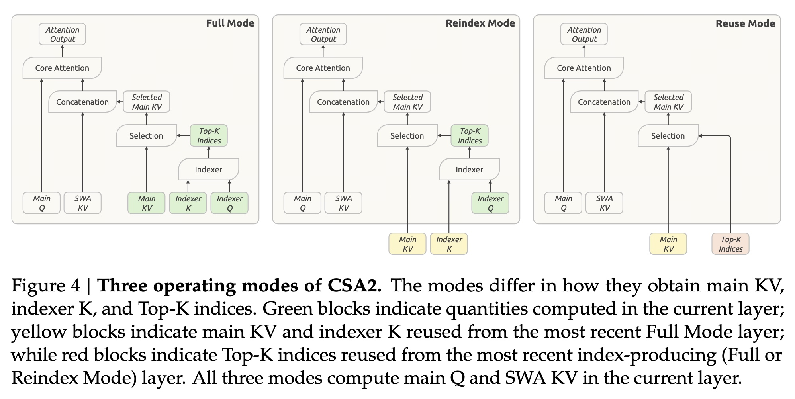

# YOCO: Cross-Layer KV Sharing

With the release of DeepSeek-V4.1-Flash, YOCO has come back into the spotlight. In my view, YOCO is an excellent piece of work, and several interesting variants have emerged from it.

YOCO has two main motivations:

1. **Prefill–Decode (PD) asymmetry.** The main job of Prefill is to build the cache. Only the last prompt token needs to produce the first logits; earlier tokens do not need to compute logits at all. A standard Transformer struggles to fully exploit this asymmetry because each layer needs its own KV Cache. YOCO instead lets the later Cross-Decoder layers share a single global Shared KV, allowing earlier tokens in a long Prefill to exit as soon as the Shared KV has been built. This substantially amplifies the benefits of PD asymmetry. (Su Jianlin has also discussed this on Zhihu.)

2. **Compressing the KV Cache along the layer dimension.** KV Cache size can be viewed approximately as the product of three dimensions: entry (dimensionality and number of heads) × sequence (length) × layer (number of layers). Previous work has already compressed it along different dimensions:

    - **Entry**: GQA/MQA reduce the number of KV heads, while MLA compresses the per-token KV representation dimension $d_{\mathrm{KV}}$.
    - **Sequence**: Attention mechanisms such as CSA/HCA/Linear reduce the caching requirements associated with the history length $N$.
    - **Layer**: YOCO-style methods target the layer dimension, letting later layers share a single global KV Cache.

## 1. YOCO

{width=70%}

{width=90%}

YOCO's architecture is very straightforward: split a standard decoder-only Transformer into two halves.

**The first half is the Self-Decoder.** More aggressively, this part even uses gated retention or sliding-window attention to further compress the entire context into **a shared global KV Cache**.

**The second half is the Cross-Decoder.** Each layer no longer stores its own historical K/V. Instead, it uses its own Query to cross-attend to the same shared KV.

The KV Cache cost of a standard Transformer drops from roughly $O(LND)$ to:

$$
O\!\left((N+L)D\right).
$$

Even better, Prefill does not need to run the later Cross-Decoder at all (which is incredibly useful for the extremely long inputs in today's agent scenarios).

\clearpage

## 2. YOCO-U

{width=65%}

YOCO-U adds **Loop** to the earlier Self-Decoder—that idea that has remained shrouded in uncertainty while attracting wave after wave of attention this year. It loops the Self-Decoder three times to produce a Shared KV; the change on the Cross-Decoder side is to use **NOPE**.

{width=75%}

{width=80%}

\clearpage

## 3. YOCO-Sparse

YOCO-Sparse takes an even more direct approach: since multiple Cross-Decoder layers in YOCO's second half already read the same KV Cache, why not **share the Routing Index for Sparse Attention too**? Savings on top of savings.

## 4. DeepSeek-V4.1-Flash

DeepSeek has always been extremely, extremely, extremely aggressive about compressing KV, and this time 4.1 takes it to a truly jaw-dropping level.

DeepSeek-V4.1-Flash's Attention is roughly **YOCO/CED + CSA2 + SWA**.

### YOCO/CED: Reducing Prefill Computation

Global KV follows the overall YOCO framework, splitting the 40 layers into **a 20-layer Causal Encoder + a 20-layer Decoder**. DeepSeek itself calls this the CED architecture.

During Prefill, the first 20 layers run. The Decoder's Global KV is generated directly from the Encoder's final layer, $H_{20}$, through independent projections for each layer. This avoids running the entire prompt through all of the last 20 layers again.

### CSA2: Reusing Global KV and Top-K Across Layers

On top of this, Global Attention uses CSA2 for reuse across layers:

- **Full layers**: Generate new Global KV and Top-K.
- **Reindex layers**: Reuse KV but select Top-K again.
- **Reuse layers**: Reuse both KV and Top-K.

Within the Decoder, only the first Full layer generates Global KV. Subsequent layers share this KV, with Reindex updating the retrieval positions every few layers. Global Sparse Attention ultimately reads only the **Top-512 remote KV entries**.

### SWA: Short-Term Caching and Local Reconstruction

To save even more storage, DeepSeek no longer keeps SWA KV in the persistent cache for the long term. What it mainly retains long-term is Global KV, while SWA KV lives only in a host-DRAM pool with a short TTL. **Global Main KV uses FP4, while SWA KV stays in FP8**.

If SWA KV is lost, reconstructing it would normally require replaying $128\times\text{layers}$ tokens, since the effective receptive field of stacked SWA layers grows with the number of layers. But DS V4.1 simply **replays only the last 128 tokens** (it is so good at squeezing out savings, I could cry…).

During Decode, each new token still passes through all 40 layers as usual, using **Top-512 Global Sparse KV + 128 Local SWA KV** together.

\clearpage

## 5. Gemma 4 E2B / E4B

Gemma 4 actually has quite a few architectural tricks, and E2B / E4B also use a technique similar to YOCO.

The idea is simple and direct: **many layers in the later part stop computing their own K/V, keep only their independent Q, and reuse the KV from the last earlier Attention layer of the same type.**

| Model | Total Layers | Later Layers Sharing KV | Sliding Attention KV Source | Full / Global Attention KV Source |
| :--- | :--- | :--- | :--- | :--- |
| **Gemma 4 E2B** | 35 | L15–L34 | KV from L13 | KV from L14 |
| **Gemma 4 E4B** | 42 | L24–L41 | KV from L22 | KV from L23 |

## 6. WeLM

WeLM also does something similar to YOCO with **KV-Mirror**, but its fundamental goal is not to save KV Cache; it is to **save Prefill computation**.

Specifically, it uses **a U-shaped KV sharing strategy**: the first third of the layers are mirrored to the last third for sharing. What is reused is the mirrored layers' **Hidden States before the K/V projections (not the KV!)**. The target layers' own projections then recompute K/V, saving the full Attention, MoE, and other computations in the last third of the layers during Prefill.

Why a U shape? An earlier paper, KVSharer, found that **sharing KV between layers that differ more actually leads to better performance**.
